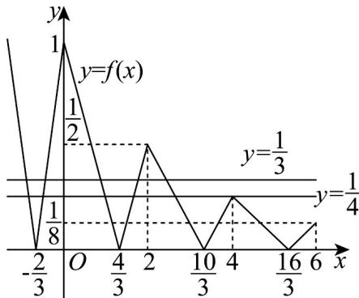

> [!faq]- 《专题03 函数的应用（二）的四大常考题型（高效培优专项训练）》官方解析
>
> > [!success]- **【答案】** C
>
> > [!note]- **【解析】**
> > 函数 $f(x)$ 的部分图象如图所示.
> >
> > 由方程 $12[f(x)]^2 - 7f(x) + 1 = 0$ ，解得 $f(x) = \frac{1}{3}$ 或 $f(x) = \frac{1}{4}$ . 当 $f(x) = \frac{1}{3}$ 时，有5个实根，当 $f(x) = \frac{1}{4}$ 时，有6个实根，故方程 $12[f(x)]^2 - 7f(x) + 1 = 0$ 的实根个数为11.
> >
> > 故选：C.
> >
> > 
