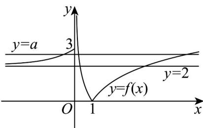

> [!faq]- 《专题03 函数的应用（二）的四大常考题型（高效培优专项训练）》官方解析
>
> > [!success]- **【答案】** A. [1,2] B. (2,3] C. (2,+\infty) D. (3,+\infty)
>
> > [!note]- **【解析】**
> > 方程 $[f(x)]^2 - (a + 2)f(x) + 2a = 0$ 化为 $[f(x) - 2][f(x) - a] = 0$ ，解得 $f(x) = 2$ 或 $f(x) = a$ ，函数 $f(x)$ 在 $(- \infty, 0]$ 上单调递增，函数值的集合为 $(2,3]$ ，在 $(0,1]$ 上单调递减，函数值的集合为 $[0, +\infty)$ ，在 $[1, +\infty)$ 上单调递增，函数值的集合为 $[0, +\infty)$ ，
> >
> > 在同一坐标系内作出直线 $y = 2, y = a$ 与函数 $y = f(x)$ 的图象，
> >
> > 
> >
> > 显然直线 y = 2 与函数 $y = f(x)$ 的图象有两个交点，
> >
> > 由关于 $x$ 的方程 $[f(x)]^2 - (a + 2)f(x) + 2a = 0$ 恰有5个不同实数解，则直线 $y = a$ 与函数 $y = f(x)$ 的图象有3
> >
> > 个交点，
> >
> > 此时 $2 < a \leq 3$ ，所以实数 $a$ 的取值范围是 $(2,3]$ .
> >
> > 故选 **B**
