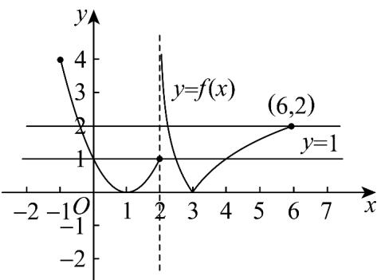

> [!faq]- 《专题03 函数的应用（二）的四大常考题型（高效培优专项训练）》官方解析
>
> > [!success]- **【答案】** A
>
> > [!note]- **【解析】**
> > 关于 $x$ 的方程 $\left[f(x)\right]^2 - (a + 1)f(x) + a = 0$ 可化简为 $\left[f(x) - 1\right]\left[f(x) - a\right] = 0$ 即 $f(x) = 1, f(x) = a$ 有7个不同的根，画出 $y = f(x)$ 的图象，
> >
> > 
> >
> > 观察可以看出当 $f(x)=1$ 有 4 个不同的根，
> >
> > 故只需 $f(x)=a$ 有 3 个不同的根即可，所以 $1<a\leq2\cdot$
> >
> > 故选 **A**.
