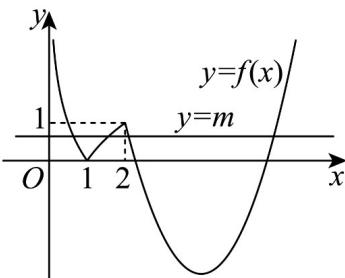

> [!faq]- 《专题03 函数的应用（二）的四大常考题型（高效培优专项训练）》官方解析
>
> > [!success]- **【答案】** BCD
>
> > [!note]- **【解析】**
> > 作出 $f(x)$ 的图象如下：令 $f(x) = m$ ，则 $\log_2x_2 = -\log_2x_1,x_3 + x_4 = 8$
> >
> > 故 $x_{2}x_{1} = 1, x_{3} + x_{4} = 8$ ， $0 < m < 1$ ，A 错误，BC 正确，
> >
> > 令 $x^{2} - 8x + 13 = 0$ ，则 $x = 4 - \sqrt{3}$ 或 $x = 4 + \sqrt{3},$
> >
> > $\frac{\left(x_{3}+x_{4}\right)x_{3}}{8x_{1}x_{2}}=x_{3}$ ，结合图象可知 $x_{3}\in\left(2,4-\sqrt{3}\right)$ ，D正确.
> >
> > 故选：BCD
> >
> > 
