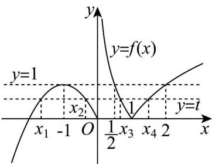

> [!faq]- 《专题03 函数的应用（二）的四大常考题型（高效培优专项训练）》官方解析
>
> > [!success]- **【答案】** $(0,1)$ $\left(0,\frac{1}{2}\right)$
>
> > [!note]- **【解析】**
> > 画出 $f(x) = \left\{ \begin{array}{ll} - x^2 - 2x, & x \leq 0 \\ |\log_2x|, & x > 0 \end{array} \right.$ 的图象：
> >
> > 
> >
> > 因为方程 $f(x)-t=0$ 即 $f(x)=t$ 有四个不同解 $x_{1}$ ， $x_{2}$ ， $x_{3}$ ， $x_{4}$ ，
> >
> > 故 $f(x)$ 的图象与 $y = t$ 有四个不同的交点，
> >
> > 由图可知 $0 < t < 1$ ，所以实数 $t$ 的取值范围是 $(0,1)$
> >
> > 又 $f\left(\frac{1}{2}\right) = f(2) = 1$ ，不妨假设 $x_{1} <   x_{2} <   x_{3} <   x_{4}$
> >
> > 由图可知 $\frac{x_1 + x_2}{2} = -1 \Rightarrow x_1 + x_2 = -2$ .
> >
> > 又由图可知 $\left|\log_2x_3\right| = \left|\log_2x_4\right|$ ，故 $-\log_2x_3 = \log_2x_4\Rightarrow \log_2x_3x_4 = 0$
> >
> > 故 $x_{3}x_{4}=1$ 且 $\frac{1}{2}<x_{3}<1,1<x_{4}<2$ ，所以 $x_{4}=\frac{1}{x_{3}}$ .
> >
> > 所以 $x_{1} + x_{2} + x_{3} + x_{4} = -2 + x_{3} + \frac{1}{x_{3}}$ ，由对勾函数性质可知 $\mathrm{y} = \mathrm{x} + \frac{1}{\mathrm{x}}$ 在 $\left(\frac{1}{2}, 1\right)$ 单调递减，
> >
> > 所以 $2 < x_{3} + \frac{1}{x_{3}} < \frac{5}{2}$ ，所以 $x_{1} + x_{2} + x_{3} + x_{4} = -2 + x_{3} + \frac{1}{x_{3}} \in \left(0, \frac{1}{2}\right)$ .
> >
> > 故答案为： $(0,1)$ ； $\left(0,\frac{1}{2}\right)$
