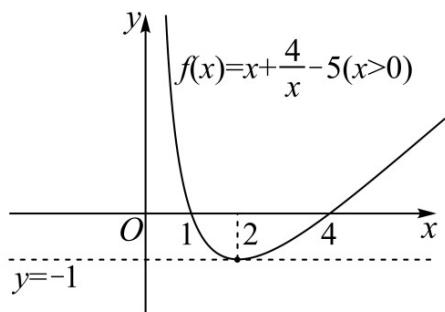
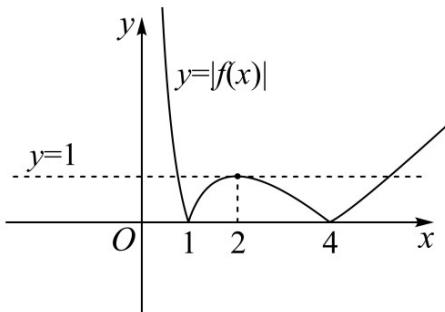

> [!faq]- 《专题03 函数的应用（二）的四大常考题型（高效培优专项训练）》官方解析
>
> > [!success]- **【答案】** (1)证明见解析 (2) 答案见解析
>
> > [!note]- **【解析】**
> > （1）任取 $x_{1}, x_{2} \in (0, +\infty)$
> >
> > $$
> > f \left(x _ {1}\right) - f \left(x _ {2}\right) = \left(x _ {1} + \frac {4}{x _ {1}} - 5\right) - \left(x _ {2} + \frac {4}{x _ {2}} - 5\right) = \frac {\left(x _ {1} - x _ {2}\right) \left(x _ {1} x _ {2} - 4\right)}{x _ {1} x _ {2}}
> > $$
> >
> > 令 $x_{1}, x_{2} \in (2, +\infty)$ ，且 $x_{1} < x_{2}$
> >
> > 则 $x_{1}-x_{2}<0,\quad x_{1}x_{2}>4>0,x_{1}x_{2}-4>0$
> >
> > 所以 $f(x_{1})-f(x_{2})<0$ ，即 $f(x_{1})<f(x_{2})$
> >
> > 故函数 $f(x)$ 在 $(2,+\infty)$ 上单调递增.
> >
> > (2) 关于 $x$ 的方程 $\left|f(x)\right| = k(k \in \mathbf{R})$ 的实数解的个数，等价于函数 $y = \left|f(x)\right|$ 与常函数 $y = k$ 的交点个数，
> >
> > 由（1）可得： $f(x_{1})-f(x_{2})=\frac{(x_{1}-x_{2})(x_{1}x_{2}-4)}{x_{1}x_{2}}$
> >
> > 令 $x_{1}, x_{2} \in (0, 2)$ ，且 $x_{1} < x_{2}$
> >
> > 则 $x_{1} - x_{2} < 0$ ， $0 <   x_{1}x_{2} <   4,x_{1}x_{2} - 4 <   0$
> >
> > 所以 $f(x_{1})-f(x_{2})>0$ ，即 $f(x_{1})>f(x_{2})$
> >
> > 故函数 $f(x)$ 在 $(0,2)$ 上单调递减，
> >
> > 结合（1）可得：函数 $f(x)$ 在 $(0,2)$ 上单调递减，在 $(2,+\infty)$ 上单调递增，故 $f(x)$ $f(2)=-1$ ，令 $x+\frac{4}{x}-5>0$ ，且x>0，整理得 $x^{2}-5x+4>0$ ，解得x>4或0<x<1，
> >
> > 故函数 $f(x)$ 的图象如图所示：
> >
> > 
> >
> > 可得函数 $y = \left|f(x)\right|$ 的图象如图所示：
> >
> > 
> >
> > 对于函数 $y=\left|f(x)\right|$ 与常函数 y=k 的交点个数，
> >
> > 则有：当 $k < 0$ 时，交点个数为 $0$ 个；
> >
> > 当 $k = 0$ 或 $k > 1$ 时，交点个数为2个；
> >
> > 当 $k = 1$ 时，交点个数为3个；
> >
> > 当 0 < k < 1 时，交点个数为 4 个.
