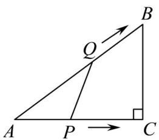
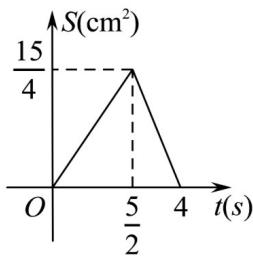
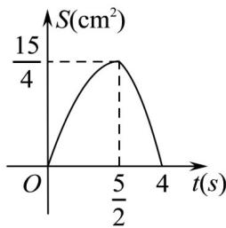
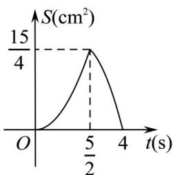
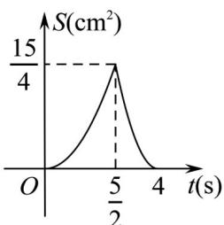
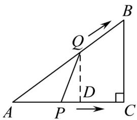
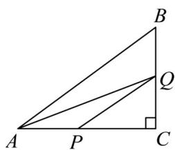

> [!faq]- 《专题03 函数的应用（二）的四大常考题型（高效培优专项训练）》官方解析
>
> > [!success]- **【答案】**  A  B  C  D 
>
> > [!note]- **【解析】**
> > $\because \angle C = 90^{\circ}$ ， $AB = 5\mathrm{cm}$ ， $AC = 4\mathrm{cm}$ ， $\therefore BC = \sqrt{AB^2 - AC^2} = 3\mathrm{cm}$
> >
> > 根据题意得：点 $Q$ 到达点 $_B$ 的时间是 $\frac{5}{2}\mathrm{s}$ ，到达点 $C$ 的时间为 $\frac{5 + 3}{2} = 4\mathrm{s}$ ，点 $P$ 到达点 $C$ 的时间为 $4\mathrm{s}$ ，当点 $Q$ 在 $AB$ 边上时（不含端点）， $0 < t < \frac{5}{2}$ ， $AQ = 2t, AP = t$ ，
> >
> > 如图，过点 $Q$ 作 $QD \perp AC$ 于点 $D$ ，则 $DQ // BC$
> >
> > 
> >
> > . $\triangle ADQ\sim \triangle ACB$
> >
> > $$
> > \therefore \frac {D Q}{B C} = \frac {A D}{A C} = \frac {A Q}{A B}
> > $$
> >
> > $$
> > \therefore \frac {D Q}{3} = \frac {A D}{4} = \frac {2 t}{5}
> > $$
> >
> > 解得： $DQ = \frac{6}{5} t$ ， $AD = \frac{8}{5} t$
> >
> > $$
> > S = \frac {1}{2} \times P A \cdot D Q = \frac {1}{2} \times t \times \frac {6}{5} t = \frac {3}{5} t ^ {2}
> > $$
> >
> > 当点 $Q$ 在 $BC$ 边上时， $\frac{5}{2} \leq t \leq 4$ ， $BQ = 2t - 5$ ， $AP = t$ ，如图，
> >
> > 
> >
> > $CQ = 8 - 2t$ $PC = 4 - t$
> >
> > $$
> > S = \frac {1}{2} A C \cdot C Q - \frac {1}{2} C Q \cdot P C = \frac {1}{2} \times 4 \times (8 - 2 t) - \frac {1}{2} (8 - 2 t) (4 - t) = - t ^ {2} + 4 t
> > $$
> >
> > 即 $S = -t^{2} + 4t$ ,
> >
> > 综上所述，与的函数关系式为 $S = \left\{ \begin{array}{ll} \frac{3}{5} t^2\left(0 < t < \frac{5}{2}\right)\\ -t^2 +4t\left(\frac{5}{2}\leq t\leq 4\right) \end{array} \right.$
> >
> > ∴函数图象第一段为过原点的开口向上的抛物线的一部分，第二段为自左向右逐渐下降的抛物线的一部分．
> >
> > 故选 **C**
