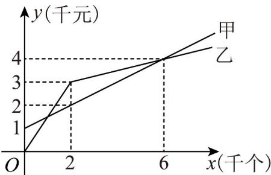

> [!faq]- 《专题03 函数的应用（二）的四大常考题型（高效培优专项训练）》官方解析
>
> > [!success]- **【答案】**  A. 选择甲厂比较划算 B. 选择乙厂比较划算 C. 若该单位需印制证书数量为 $8$ 千个，则选择乙厂比较划算 D. 当该单位需印制证书数量小于 $2$ 千个时，不管选择哪个厂，总费用都一样
>
> > [!note]- **【解析】**
> > 由图知：甲厂费用函数为 $y = \frac{1}{2} x + 1$ ，乙厂费用函数为 $y = \begin{cases} \frac{3}{2} x, & 0 < x < 2 \\ \frac{1}{4} x + \frac{5}{2}, & x - 2 \end{cases}$ ，当 $0 < x < 2$ 时， $\frac{1}{2} x + 1 = \frac{3}{2} x$ ，可得 $x = 1$ ；当 $x - 2$ 时， $\frac{1}{2} x + 1 = \frac{1}{4} x + \frac{5}{2}$ ，可得 $x = 6$ ；结合图象知：当 $0 < x < 1$ 或 $x > 6$ 时乙厂划算；当 $1 < x < 6$ 时甲厂划算；当 $x = 1$ 或 $6$ 时甲乙费用相同；所以 A、B、D 错，C 对.
> >
> > 故选 **C**
