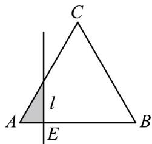
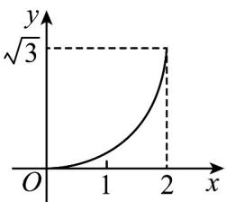
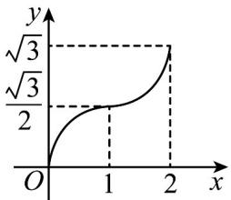
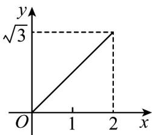
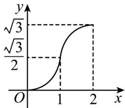
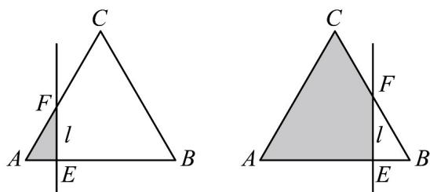

> [!faq]- 《专题03 函数的应用（二）的四大常考题型（高效培优专项训练）》官方解析
>
> > [!success]- **【答案】**  A   B C  D 
>
> > [!note]- **【解析】**
> > 因为 VABC 是边长为 $^{2}$ 的等边三角形，
> >
> > 所以当 AE = x 时，设直线 l 与 AC 交点为 F ，
> >
> > 当 $E$ 点在 $AB$ 中点左侧时， $EF = \sqrt{3} x$ ， $S_{\triangle AEF} = \frac{1}{2} x \cdot \sqrt{3} x = \frac{\sqrt{3}}{2} x^2 (0 \leq x \leq 1)$ ，
> >
> > 此时函数为开口向上的二次函数；此时可排除 BC
> >
> > 当 E 点在 AB 中点右侧时， $S_{\triangle BEF} = \frac{1}{2}(2 - x) \cdot \sqrt{3}(2 - x) = \frac{\sqrt{3}}{2}(2 - x)^{2}$
> >
> > 此时左侧部分面积为： $S_{\triangle ABC} - S_{\triangle BEF} = \frac{\sqrt{3}}{4}\times 2^2 -\frac{\sqrt{3}}{2} (2 - x)^2 = -\frac{\sqrt{3}}{2} (x - 2)^2 +\sqrt{3} (1 <   x\leq 2)$
> >
> > 此时函数为开口向下 $^{d}$ 额二次函数，此时可排除 $^{A}$ ，
> >
> > 故选：D
> >
> > 故选：D.
> >
> > 
