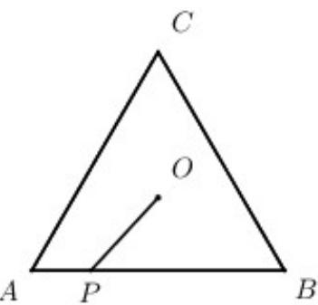
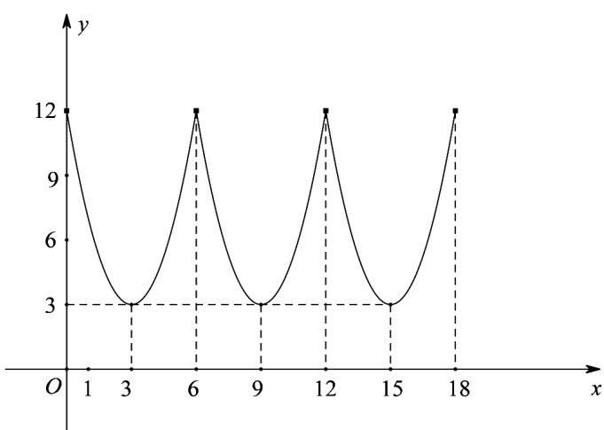
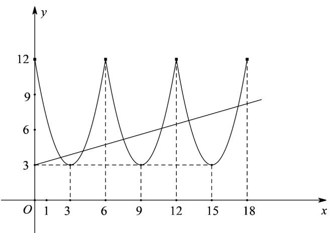

> [!faq]- 《专题03 函数的应用（二）的四大常考题型（高效培优专项训练）》官方解析
>
> > [!success]- **【答案】**  A. 函数 $f(x)$ 的最大值为 12； B．函数 $f(x)$ 的最小值为6； C．关于 x 的方程 $f(x)=kx+3$ 最多有 6 个实数根； D．当 x=3 时 $f(x)$ 能取得最大值.
>
> > [!note]- **【解析】**
> > $P$ 分别在 $AB$ 上运动时的函数解析式 $f(x) = |OP|^2 = 3 + (x - 3)^2$ ， $(0\leq x\leq 6)$
> >
> > $P$ 分别在 $BC$ 上运动时的函数解析式 $f(x) = \left|OP\right|^2 = 3 + (x - 9)^2$ ， $(6\leq x\leq 12)$
> >
> > $P$ 分别在 $CA$ 上运动时的函数解析式 $f(x) = \left|OP\right|^2 = 3 + (x - 15)^2$ ， $(12\leq x\leq 18)$
> >
> > $$
> > f (x) = \left| O P \right| ^ {2} = \left\{ \begin{array}{l} 3 + (x - 3) ^ {2}, (0 \leq x \leq 6) \\ 3 + (x - 9) ^ {2}, (6 \leq x \leq 1 2) \\ 3 + (x - 1 5) ^ {2}, (1 2 \leq x \leq 1 8) \end{array} \right.
> > $$
> >
> > 由图象可得，方程 $f(x) = kx + 3$ 最多有6个实数根，函数 $f(x)$ 的最大值为12，最小值为3，当 $x = 3$ 时 $f(x)$ 能取得最小值
> >
> > 故选：AC.
> >
> > 
> >
> > 
> >
> > 37. 湖北省孝感市孝昌县丰山镇将自身定位为“生态水果特色小镇”，这一举措充分展现了其对国家“强国必先强农，农强方能国强”号召的深刻理解与实践·通过这一发展战略，不仅促进了乡村产业的转型升级，还兼顾了生态环境保护，为乡村的全面振兴探索出了一条富有前瞻性和可持续性的道路·经调研发现：某珍稀水果树的单株产量 $W(\text{单位：千克})$ 与施用肥料 $x(\text{单位：千克})$ 满足如下关系：
> >
> > $W(x) = \left\{ \begin{array}{ll} \frac{1}{2}\log_2\frac{4^x + a}{5} + 15, & 0 \leq x \leq 2 \\ \frac{25x + b}{1 + x}, & 2 < x \leq 5 \end{array} \right.$ ，肥料成本投入为 $5x$ 元，其它成本投入如培育管理、施肥等人工费（ ）为 $^{10}x$ 元，且 $W(2) = 16$ ， $W(5) = \frac{71}{3}$ .
> >
> > (1)求实数 a, b 的值；
> >
> > (2)已知这种水果的市场售价大约为 $30$ 元/千克，且销路畅通供不应求，记该水果树的单株利润为 $f(x)$ （单位：元），当施用肥料为多少千克时，该水果树的单株利润最大？最大利润是多少？
> >
> > 【答案】(1) a = 4, b = 17. (2) 当 x = 3 时，该水果树的单株利润最大，最大利润为 645 元.
> >
> > 【详解】（1）因为 $W(2)=16$ ， $W(5)=\frac{71}{3}$ ，
> >
> > 所以 $W(2) = \frac{1}{2}\log_2\frac{16 + a}{5} +15 = 16$ ，且 $\frac{25\times 5 + b}{1 + 5} = \frac{71}{3}$ ，所以 $a = 4$ ， $b = 17$
> >
> > $$
> > f (x) = 3 0 W (x) - 1 0 x - 5 x = \left\{ \begin{array}{l} 3 0 \times \left(\frac {1}{2} \log_ {2} \frac {4 ^ {x} + 4}{5} + 1 5\right) - 1 5 x, 0 \leq x \leq 2 \\ 3 0 \times \frac {2 5 x + 1 7}{1 + x} - 1 5 x, 2 <   x \leq 5 \end{array} = \left\{ \begin{array}{l} 4 5 0 + 1 5 \log_ {2} \frac {4 ^ {x} + 4}{5} - 1 5 x, 0 \leq x \leq 2 \\ \frac {3 0 (2 5 x + 1 7)}{1 + x} - 1 5 x, 2 <   x \leq 5 \end{array} \right. \right. \tag {2}
> > $$
> >
> > 当 $x \in [0,2]$ 时， $f(x) = 450 + 15\log_2\frac{4^x + 4}{5} - 15x$
> >
> > $$
> > = 4 5 0 + 1 5 \log_ {2} \left(\frac {1}{5} \times \frac {4 ^ {x} + 4}{2 ^ {x}}\right) = 4 5 0 + 1 5 \log_ {2} \frac {2 ^ {x} + \frac {4}{2 ^ {x}}}{5},
> > $$
> >
> > 令 $2^{x} = t, t \in [1,4]$ ， $g(t) = \frac{1}{5}\left(t + \frac{4}{t}\right)$ 在 $(1,2)$ 上单调递减，在 $(2,4)$ 上单调递增，
> >
> > $g(1)=1, g(4)=1$ ，所以 $g(t)_{\max}=1$
> >
> > 于是根据对数型函数单调性的性质，
> >
> > 可知当 x=0 或 $^{2}$ 时，所以 $f(x)_{\max}=450+15\log_{2}1=450$ .
> >
> > 当 $x\in (2,5]$ 时，
> >
> > $$
> > f (x) = \frac {3 0 (2 5 x + 1 7)}{1 + x} - 1 5 x = 3 0 \left(2 5 - \frac {8}{x + 1}\right) - 1 5 x = 7 5 0 - \frac {2 4 0}{x + 1} - 1 5 x = 7 5 0 - \frac {2 4 0}{x + 1} - 1 5 (x + 1) + 1 5
> > $$
> >
> > $$
> > = 7 6 5 - 1 5 \left(\frac {1 6}{x + 1} + x + 1\right) \leq 7 6 5 - 1 5 \times 2 \sqrt {\frac {1 6}{x + 1} \cdot (x + 1)} = 6 4 5,
> > $$
> >
> > 当且仅当 $\frac{16}{x + 1} = x + 1$ 即 $x = 3$ 时等号成立
> >
> > 综上所述，当 x=3 时，该水果树的单株利润最大，最大利润为 645 元·
> >
> > 38. 随着城市居民汽车使用率的增加，交通拥堵问题日益严重，而建设高架道路、地下隧道以及城市轨道
> >
> > 公共运输系统等是解决交通拥堵的有效措施:某市城市规划部门为了提高早晚高峰期间某条地下隧道的车辆通行能力，研究了该隧道内的车流速度 $v$ （单位：千米/小时）和车流密度 $x$ （单位：辆/千米）所满足的关系式： $v = \begin{cases} 50, & 0 < x \leq 30 \\ 60 - \frac{1200}{125 - x}, & 30 < x \leq 105 \end{cases}$ ，研究表明：当隧道内的车流密度达到 $105$ 辆/千米时造成堵塞，此时的车流速度是 $^0$ 千米/小时。
> >
> > (1)若车流速度 v 不小于 $^{20}$ 千米/小时，求车流密度 x 的取值范围；
> >
> > (2)隧道内的车流量 $y$ （单位时间内通过隧道的车辆数，单位：辆/小时）满足 $y = x \cdot v$ ，求隧道内车流量的最大值（精确到 $1$ 辆/小时），并指出车流量最大时的车流密度（精确到 $1$ 辆/千米）.
> >
> > 【答案】(1) $0 < x \leq 95$ (2) 隧道内车流量的最大值约为 $2700$ 辆/小时, 此时车流密度约为 $75$ 辆/千米.
> >
> > 【详解】（1）由 $v=\left\{\begin{aligned}&50,0<x\leq30\\ &60-\frac{1200}{125-x},30<x\leq105\end{aligned}\right.$ 可得
> >
> > 当 $0 < x \leq 30$ 时， $v = 50 - 20$ ，符合题意，
> >
> > 当 $30 < x \leq 105$ 时，令 $v = 60 - \frac{1200}{125 - x}$ 20，可得 $30 < x \leq 95$
> >
> > 综上可得 $0 < x \leq 95$
> >
> > (2) 由题意得 $y = \begin{cases} 50x, & 0 < x \leq 30 \\ 60x - \frac{1200x}{125 - x}, & 30 < x \leq 105 \end{cases}$ ,
> >
> > 当 $0 < x \leq 30$ 时, $y = 50x$ 为增函数, 所以 $y \leq 1500$ , 当 $x = 30$ 时等号成立;
> >
> > 当 $30 < x \leq 105$ 时， $125 - x > 0$
> >
> > $$
> > y = 6 0 x - \frac {1 2 0 0 x}{1 2 5 - x} = - 6 0 (1 2 5 - x) - \frac {1 2 0 0 \times 1 2 5}{1 2 5 - x} + 8 7 0 0
> > $$
> >
> > $$
> > y = - \left[ 6 0 (1 2 5 - x) + \frac {1 2 0 0 \times 1 2 5}{1 2 5 - x} \right] + 8 7 0 0 \leq - 2 \sqrt {6 0 (1 2 5 - x) \cdot \frac {1 2 0 0 \times 1 2 5}{1 2 5 - x}} + 8 7 0 0 = 2 7 0 0,
> > $$
> >
> > 当且仅当 $60(125 - x) = \frac{1200 \times 125}{125 - x}$ ，即 $x = 75$ 时等号成立。
> >
> > 由于 $2700 > 1500$
> >
> > 所以隧道内车流量的最大值约为 2700 辆/小时，此时车流密度约为 75 辆/千米·
> >
> > 39. 为了贯彻落实“绿水青山就是金山银山”的发展理念，长春市一乡镇响应号召，努力打造“生态水果特色小镇”，调研发现：某生态水果的单株产量 $W$ （单位：kg）与单株肥料费用 $x$ （单位：元）满足如下关系： $W(x) = \begin{cases} 5(x^2 + 2.4), & 0 \leq x \leq 2 \\ 48 - \frac{48}{x + 1}, & 2 < x \leq 5 \end{cases}$ ，单株总成本投入为（单位：元）。已知这种水果的市场售价为 元 $30x$ /kg 且供不应求，记该生态水果的单株利润为 $f(x)$ （单位：元）。
> >
> > (1)求 $f(x)$ 的函数解析式；
> >
> > (2)当投入的单株肥料费用为多少元时，该生态水果的单株利润最大？最大利润是多少元？
> >
> > 【答案】(1) $f(x)=\left\{\begin{aligned}&50x^{2}-30x+120,0\leq x\leq2\\&480-30\left(\frac{16}{x+1}+x\right),2<x\leq5\end{aligned}\right.$
> >
> > (2)当投入的单株肥料费用为 $^{3}$ 元时，该生态水果的单株利润最大，最大利润是 $^{270}$ 元
> >
> > 【详解】（1）由题意可得 $f(x) = 10W(x) - 30x = \begin{cases} 50(x^2 + 2.4) - 30x, & 0 \leq x \leq 2 \\ 480 - \frac{480}{x + 1} - 30x, & 2 < x \leq 5 \end{cases}$ ，
> >
> > 所以单株利润 $f(x)$ 的函数解析式为： $f(x) = \begin{cases} 50x^2 - 30x + 120, & 0 \leq x \leq 2 \\ 480 - 30\left(\frac{16}{x + 1} + x\right), & 2 < x \leq 5 \end{cases}$
> >
> > (2) 当 $0 \leq x \leq 2$ 时， $f(x) = 50x^2 - 30x + 120$ 为开口向上的抛物线，
> >
> > 其对称轴为： $x = -\frac{-30}{2\times 50} = \frac{3}{10}$
> >
> > 所以当 x=2 时 $f(x)_{\max}=f(2)=50\times2^{2}-30\times2+120=260$
> >
> > 当 $2 < x \leq 5$ 时， $x + 1 \in (3,6]$
> >
> > $$
> > f (x) = 4 8 0 - 3 0 \left(\frac {1 6}{x + 1} + x\right) = 4 8 0 - 3 0 \left(\frac {1 6}{x + 1} + x + 1\right) + 3 0 = 5 1 0 - 3 0 \left(\frac {1 6}{x + 1} + x + 1\right)
> > $$
> >
> > $$
> > \leq 5 1 0 - 3 0 \times 2 \sqrt {\frac {1 6}{x + 1} \times (x + 1)} = 2 7 0
> > $$
> >
> > 当且仅当 $\frac{16}{x + 1} = x + 1$ 即 $x = 3$ 时等号成立，此时 $f(x)_{\mathrm{max}} = 270$
> >
> > 综上所述：当投入的单株肥料费用为 $^{3}$ 元时，该生态水果的单株利润最大，最大利润是270元
> >
> > 40．湖水中溶解性有机物可分为内源类有机物和外源类有机物．某人工调控水量的天然湖泊中，经总时长为 150 天的持续观测，发现外源类有机物含量随时间 t（单位：天）可用函数 $Y(t)=\left\{\begin{aligned}&20,1\leq t<60\\&-\frac{1}{100}(t-120)^{2}+56,60\leq t\leq150\end{aligned}\right.$ 表示，内源类有机物含量可用函数 $N(t)=\left\{\begin{aligned}&t+\frac{1400}{t+10}-30,1\leq t<60\\&50,60\leq t\leq150\end{aligned}\right.$ 表示．在一日内，若内源类有机物和外源类有机物含量之差的绝对值不大于 $^{10}$ ，则认为当日该湖中溶解性有机物相对平衡．
> >
> > (1)求这 $^{150}$ 天内该湖中溶解性有机物相对平衡的天数；
> >
> > (2)求这 150 天内该湖中溶解性有机物含量的最大值.
> >
> > 【答案】(1)71 天 (2) $\frac{1301}{11}$
> >
> > 【详解】（1）当 $t \in [1,60)$ ， $Y(t) = 20$ ，若湖中溶解性有机物相对平衡，则 $10 \leq N(t) \leq 30$
> >
> > 即 $10 \leq t + \frac{1400}{t + 10} - 30 \leq 30$ ，则 $\left\{ \begin{array}{l} t + \frac{1400}{t + 10} - 30 \leq 30 \\ 10 \leq t + \frac{1400}{t + 10} - 30 \end{array} \right.$ ，整理得 $\left\{ \begin{array}{l} t^2 - 50t + 800 \leq 0 \\ t^2 - 30t + 1000 = 0 \end{array} \right.$ ，
> >
> > 对于 $t^2 - 50t + 800 \leq 0$ ，由于 $\Delta = 50^2 - 4 \times 800 < 0$ ，故不等式无解，
> >
> > 所以上述不等式组无解，即 $t \in [1,60)$ 时不能使该湖中溶解性有机物相对平衡；
> >
> > 当 $t \in [60, 150]$ ， $N(t) = 50$ ，若湖中溶解性有机物相对平衡，
> >
> > 则 $40 \leq Y(t) \leq 60$ ，当 $t = 120$ 时， $Y(t)$ 最大，此时 $Y(t) = 56$
> >
> > 故只需要求 $Y(t)$ 40的解集，
> >
> > 即 $-\frac{1}{100}(t - 120)^2 + 5640$ ，整理得 $(t - 120)^2 \leq 1600$ ，解得 $t \in [80, 160]$ ，
> >
> > 又 $t\in [60,150]$ ，所以 $t\in [80,150]$
> >
> > 综上，当 $t \in [80, 150]$ 时该湖中溶解性有机物相对平衡，共71天；
> >
> > (2) 记该湖中溶解性有机物含量为 $Z(t)=\left\{\begin{aligned}&t+\frac{1400}{t+10}-10,1\leq t<60\\&-\frac{1}{100}(t-120)^{2}+106,60\leq t\leq150\end{aligned}\right.$
> >
> > 当 $t\in [1,60)$ ， $Z(t) = t + \frac{1400}{t + 10} -10 = t + 10 + \frac{1400}{t + 10} -20$
> >
> > 令 $m = t + 10 \in [11,70)$ ，则 $y = m + \frac{1400}{m} - 20$ ，
> >
> > 由对勾函数的单调性知， $y = m + \frac{1400}{m} - 20$ 在 $(0, 10\sqrt{14})$ 单调递减，在 $(10\sqrt{14}, +\infty)$ 单调递增，
> >
> > 所以 $y = m + \frac{1400}{m} - 20$ 在 $\left[11, 10\sqrt{14}\right)$ 单调递减，在 $\left(10\sqrt{14}, 70\right)$ 单调递增；
> >
> > 当 $m = 11$ 时， $y = 11 + \frac{1400}{11} - 20 = \frac{1301}{11}$ ，
> >
> > 当 $m = 70$ 时， $y = 70 + \frac{1400}{70} - 20 = \frac{1301}{11} = 70$
> >
> > 因为 $\frac{1301}{11} > 70$ ，所以 $y = m + \frac{1400}{m} - 20$ 的最大值为 $\frac{1301}{11}$ ，
> >
> > 即当 $t \in [1,60)$ 时，该湖中溶解性有机物含量的最大值为 $\frac{1301}{11}$ ；
> >
> > 当 $t\in [60,150]$ ， $Z(t) = -\frac{1}{100} (t - 120)^2 +106$
> >
> > 当 t=120 时， $Z(t)$ 取最大值，最大值为 106，
> >
> > 即当 $t \in [60, 150]$ 时，该湖中溶解性有机物含量的最大值为 $^{106}$
> >
> > 由 $\frac{1301}{11} > 106$ ，所以这 $^{150}$ 天内该湖中溶解性有机物含量的最大值为 $\frac{1301}{11}$ .
