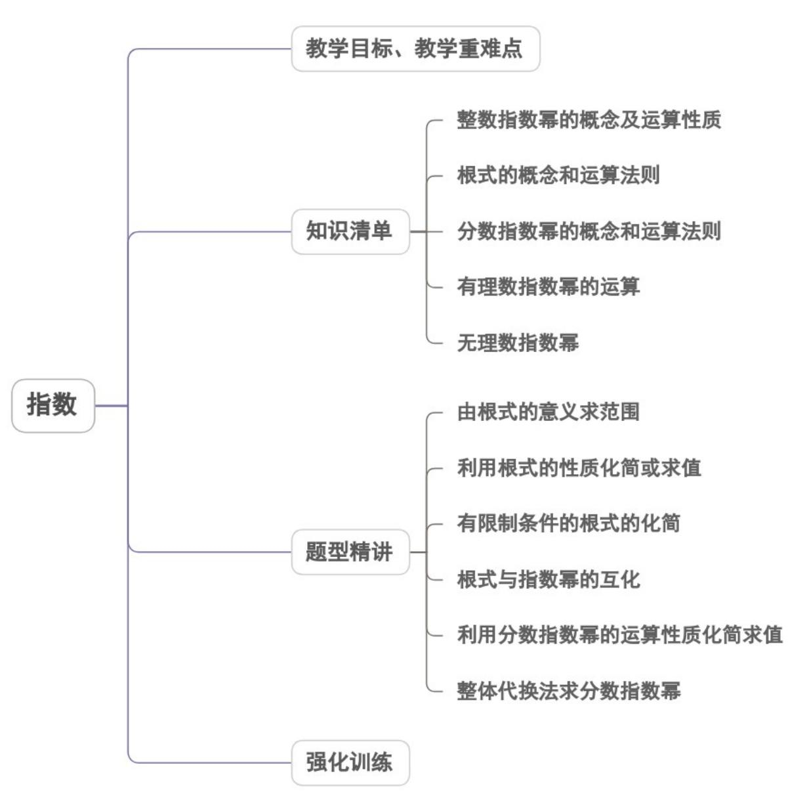

<!-- source-part:1 pages:1-38 -->

专题4.1 指数

内容概览

## 教学目标、教学重难点

<table><tr><td>教学目标</td><td>1.理解根式和分数指数幂的含义,并且能进行两者之间的互化。2.掌握根式的性质,并能运用根式的运算性质进行根式的运算。3.掌握实数指数幂的运算性质,学会化简较复杂的运算式子。</td></tr><tr><td>教学重难点</td><td>1.重点:掌握无理数、实数指数幂的计算。2.难点:掌握根式的性质,并能运用根式的运算性质进行根式的运算.</td></tr></table>

## 知识清单

## 知识点 01 整数指数幂的概念及运算性质

## 1、整数指数幂的概念

$$
a ^ {n} = \underset {n \text {个} a} {\mathfrak {g}} \left[ a \cdot \underset {n \text {个} a} {\mathfrak {g}} \right] a (n \in Z ^ {*})
$$

$$
a ^ {0} = 1 (a \neq 0)
$$

$$
a ^ {- n} = \frac {1}{a ^ {n}} (a \neq 0, n \in Z ^ {*})
$$

## 2、运算法则

(1) $a^m \cdot a^n = a^{m+n}$ ; (2) $\left(a^m\right)^n = a^{mn}$ ; (3) $\frac{a^m}{a^n} = a^{m-n}(m > n, a \neq 0)$ ; (4) $(ab)^m = a^mb^m$

## 【即学即练】

1. 计算： $a^{\frac{\pi}{3}}a^{\frac{2\pi}{3}}a^{-\pi}=$ \_\_\_\_.

【答案】1

【详解】 $a^{\frac{\pi}{3}}\cdot a^{\frac{2\pi}{3}}\cdot a^{-\pi} = a^{\frac{\pi}{3} +\frac{2\pi}{3} -\pi} = a^{0} = 1$

2. 设 $a > 0$ ，下列运算中，正确的是（ ）A. $a^2 \cdot a^3 = a^6$ B. $(-a^2)^3 = (-a^3)^2$ C. $(-a^2)^3 = -a^6$ D. $a^2 \div a^3 = a^{\frac{2}{3}}$

【答案】C

【详解】 $A$ 中， $a^2 \cdot a^3 = a^5$ ； $B$ 中， $\left(-a^2\right)^3 = -a^6 \neq \left(-a^3\right)^2 = a^6$ ； $C$ 正确； $D$ 中， $a^2$ ， $a^3 = a^{-1}$

## 知识点 02 根式的概念和运算法则

1、 $n$ 次方根的定义：若 $x^{n} = y(n\in N^{*},n > 1,y\in R)$ ，则 $x$ 称为 $y$ 的 $n$ 次方根.

$n$ 为奇数时，正数 $y$ 的奇次方根有一个，是正数，记为 $\sqrt[n]{y}$ ；负数 $y$ 的奇次方根有一个，是负数，记为 $\sqrt[n]{y}$ ；

零的奇次方根为零，记为 $\sqrt[n]{0} = 0$

$n$ 为偶数时，正数 $y$ 的偶次方根有两个，记为 $\pm \sqrt[n]{y}$ ；负数没有偶次方根；零的偶次方根为零，记为 $\sqrt[n]{0} = 0$ 。

2、两个等式

(1) 当 $n > 1$ 且 $n \in N^{*}$ 时， $\left(\sqrt[n]{a}\right)^{n} = a$ ；(2) $\sqrt[n]{a^{n}} = \begin{cases} a, & (n \text{为奇数}) \\ |a| & (n \text{为偶数}) \end{cases}$

【即学即练】

1. 计算： $\sqrt{-x^3} = (\quad)$ A. $x\sqrt{-x}$ B. $-x\sqrt{x}$ C. $-x\sqrt{-x}$ D. $x\sqrt{x}$

【答案】C

【详解】由已知 $x \leq 0$ ， $\therefore \sqrt{-x^3} = \sqrt{-x \cdot (-x)^2} = -x \cdot \sqrt{-x}$ .

故选：C.

2. 计算下列各题：

$$
(1) ^ {(\sqrt {6} - 2 \sqrt {1 5}) \times \sqrt {3} - 6 \sqrt {\frac {1}{2}}};
$$

$$
\sqrt {4 x} + 2 \sqrt {2 x} - \frac {1}{2} \sqrt {8 x} - 4 \sqrt {x} \tag {2}
$$

【答案】(1) $-6\sqrt{5}$

(2) $\sqrt{2x} - 2\sqrt{x}$

【详解】（1） $(\sqrt{6} - 2\sqrt{15}) \times \sqrt{3} - 6\sqrt{\frac{1}{2}} = 3\sqrt{2} - 6\sqrt{5} - 3\sqrt{2} = -6\sqrt{5}$

$$
\sqrt {4 x} + 2 \sqrt {2 x} - \frac {1}{2} \sqrt {8 x} - 4 \sqrt {x} = 2 \sqrt {x} + 2 \sqrt {2 x} - \sqrt {2 x} - 4 \sqrt {x} = \sqrt {2 x} - 2 \sqrt {x}
$$

## 知识点 03 分数指数幂的概念和运算法则

为避免讨论，我们约定 $a > 0$ ， $n$ ， $m\in N^{*}$ ，且 $\frac{m}{n}$ 为既约分数，分数指数幂可如下定义：

$$
a ^ {\frac {1}{n}} = \sqrt [ n ]{a}
$$

$$
a ^ {\frac {m}{n}} = (\sqrt [ n ]{a}) ^ {m} = \sqrt [ n ]{a ^ {m}}
$$

$$
a ^ {- \frac {m}{n}} = \frac {1}{a ^ {\frac {m}{n}}}
$$

## 【即学即练】

1. $\sqrt[3]{a\cdot\sqrt{a}} (a > 0)$ 的分数指数幂表示为（ ）A. $a^{\frac{1}{2}}$ B. $a^{\frac{3}{2}}$ C. $a^{\frac{3}{4}}$ D. 都不对

【答案】A

【详解】原式 $= \sqrt[3]{a\cdot a^{\frac{1}{2}}} = \sqrt[3]{a^{\frac{3}{2}}} = a^{\frac{3}{2}\times \frac{1}{3}} = a^{\frac{1}{2}}$

2. 若 $m = \sqrt{2}$ ，则 $\left(2^{\sqrt{3}} \cdot \sqrt{m^{\sqrt{3}}}\right)^{2\sqrt{3}} = (\quad)$ A. $64\sqrt{2}$ B. $32\sqrt{3}$ C. 64 D. $128\sqrt{2}$

【答案】D

【详解】 $\left(2^{\sqrt{3}}\cdot \sqrt{m^{\sqrt{3}}}\right)^{2\sqrt{3}} = \left(2^{\sqrt{3}}\cdot m^{\frac{\sqrt{3}}{2}}\right)^{2\sqrt{3}} = 2^{6}m^{3} = 128\sqrt{2}$

## 知识点 04 有理数指数幂的运算

1、有理数指数幂的运算性质

$$
(a > 0, b > 0, \alpha , \beta \in Q) (1) a ^ {\alpha} \cdot a ^ {\beta} = a ^ {\alpha + \beta}; (2) (a ^ {\alpha}) ^ {\beta} = a ^ {\alpha \beta}; (3) (a b) ^ {\alpha} = a ^ {\alpha} b ^ {\alpha};
$$

当 $a > 0$ ， $p$ 为无理数时， $a^p$ 是一个确定的实数，上述有理数指数幂的运算性质仍适用。

2、指数幂的一般运算步骤

有括号先算括号里的；无括号先做指数运算．负指数幂化为正指数幂的倒数．底数是负数，先确定符号，底

数是小数，先要化成分数，底数是带分数，先要化成假分数，然后要尽可能用幂的形式表示，便于用指数运

算性质．在化简运算中，也要注意公式： $a^2 - b^2 = (a - b)(a + b)$ ， $(a \pm b)^2 = a^2 \pm 2ab + b^2$

$(a \pm b)^{3} = a^{3} \pm 3a^{2}b + 3ab^{2} \pm b^{3}$ ， $a^{3} - b^{3} = (a - b)(a^{2} + ab + b^{2})$ ， $a^{3} + b^{3} = (a + b)(a^{2} - ab + b^{2})$ 的运用，能够简

化运算.

【即学即练】

1. (1) 化简： $\frac{\left(\sqrt[3]{a^2b}\right)^2\cdot\sqrt[3]{a}}{\sqrt[3]{b}\cdot\sqrt[3]{a^2b^4}}(a > 0,b > 0)$

(2) 已知 $x - x^{-1} = 2\sqrt{3}(x > 0)$ ，求 $\frac{x^{2} - x^{-2}}{x^{2} + x^{-2}}$ .

【答案】 $(1)\frac{a}{b}$ ; $(2)\frac{4\sqrt{3}}{7}$ .

【详解】（1） $\frac{\left(\sqrt[3]{a^{2}b}\right)^{2}\cdot\sqrt[3]{a}}{\sqrt[3]{b}\cdot\sqrt[3]{a^{2}b^{4}}}=\frac{a^{\frac{4}{3}}\cdot b^{\frac{2}{3}}\cdot a^{\frac{1}{3}}}{b^{\frac{1}{3}}\cdot a^{\frac{2}{3}}\cdot b^{\frac{4}{3}}}=\frac{a^{\frac{5}{3}}\cdot b^{\frac{2}{3}}}{a^{\frac{2}{3}}\cdot b^{\frac{5}{3}}}=\frac{a}{b}$

(2) $\because x - x^{-1} = 2\sqrt{3}(x > 0)$ ， $\therefore (x - x^{-1})^2 = 12$ ，即 $x^2 + x^{-2} - 2 = 12$

$\therefore x^{2} + x^{-2} = 14$ ， $\therefore \left(x + x^{-1}\right)^{2} = x^{2} + x^{-2} + 2 = 16$ 故 $x + x^{-1} = 4$

$\therefore \frac{x^2 - x^{-2}}{x^2 + x^{-2}} = \frac{(x + x^{-1})(x - x^{-1})}{x^2 + x^{-2}} = \frac{4 \times 2\sqrt{3}}{14} = \frac{4\sqrt{3}}{7}$ .

2. (1) 求值： $16^{\frac{1}{4}} + (\sqrt{3} - 2)^{-1} + 0.75^{-1} \times \left(\frac{\sqrt{3}}{2}\right)^{\frac{1}{2}} \times \left(6\frac{3}{4}\right)^{\frac{1}{4}}$ .

$$
m ^ {3 x} + m ^ {- 3 x}
$$

(2) 设 $m^{2x}=2$ ，且 m>0，求 $\overline{m^{x}+m^{-x}}$ 的值.

【答案】 $(1)^{2-\sqrt{3}}$ ; $(2)^{\frac{3}{2}}$

【详解】（1） $16^{\frac{1}{4}}+\left(\sqrt{3}-2\right)^{-1}+0.75^{-1}\times\left(\frac{\sqrt{3}}{2}\right)^{\frac{1}{2}}\times\left(6\frac{3}{4}\right)^{\frac{1}{4}}$

$$
= \left(2 ^ {4}\right) ^ {\frac {1}{4}} + \frac {1}{\sqrt {3} - 2} + \left(\frac {3}{4}\right) ^ {- 1} \times \left(\frac {\sqrt {3}}{2}\right) ^ {\frac {1}{2}} \times \left(\frac {2 7}{4}\right) ^ {\frac {1}{4}}
$$

$$
= 2 - (\sqrt {3} + 2) + \frac {4}{3} \times \left(\frac {3}{4}\right) ^ {\frac {1}{4}} \times \left(\frac {2 7}{4}\right) ^ {\frac {1}{4}}
$$

$$
= - \sqrt {3} + \frac {4}{3} \times \left(\frac {3 \times 2 7}{4 \times 4}\right) ^ {\frac {1}{4}} = - \sqrt {3} + \frac {4}{3} \times \frac {3}{2} = 2 - \sqrt {3}.
$$

(2) 因为 $m^{2x}=2$ ，且 m>0

所以 $\frac{m^{3x} + m^{-3x}}{m^x + m^{-x}} = \frac{\left(m^x\right)^3 + \left(m^{-x}\right)^3}{m^x + m^{-x}}$

$$
= \frac {\left(m ^ {x} + m ^ {- x}\right) \left(m ^ {2 x} - m ^ {- x} \cdot m ^ {x} + m ^ {- 2 x}\right)}{m ^ {x} + m ^ {- x}}.
$$

$$
= m ^ {2 x} - 1 + m ^ {- 2 x} = m ^ {2 x} - 1 + \frac {1}{m ^ {2 x}} = 2 - 1 + \frac {1}{2} = \frac {3}{2}.
$$

## 知识点 05 无理数指数幂

一般地，无理数指数幂 $a^\alpha$ （ $a > 0$ ， $\alpha$ 为无理数）是一个确定的实数．有理数指数幂的运算性质同样适用于无理数指数幂．

【注意】（1）对于无理数指数幂，我们只需要了解两点：

①它是一个确定的实数；②它是有理数指数幂无限逼近的结果。

(2) 定义了无理数指数幂之后，幂的指数就由原来的有理数范围扩充到了实数范围。

【即学即练】

1. 计算：

$$
(1) \left(2 \frac {1}{4}\right) ^ {0. 5} - (3. 1 4) ^ {0} - \left(3 \frac {3}{8}\right) ^ {- \frac {2}{3}} + 1. 5 ^ {- 2}
$$

(2) $\sqrt[3]{a^{\frac{9}{2}}\sqrt{a^{-3}}} \div \sqrt[3]{\sqrt[3]{a^{-7}}\sqrt[3]{a^{13}}}$ ( $a > 0$ )

【答案】(1) $\frac{1}{2}$ ；

(2)1

【详解】（1） $\left(2\frac{1}{4}\right)^{0.5} - (3.14)^{0} - \left(3\frac{3}{8}\right)^{-\frac{2}{3}} + 1.5^{-2} = (\frac{3}{2})^{2\times 0.5} - 1 - (\frac{3}{2})^{3\times (-\frac{2}{3})} + (\frac{3}{2})^{-2}$

$$
= \frac {3}{2} - 1 - (\frac {3}{2}) ^ {- 2} + (\frac {3}{2}) ^ {- 2} = \frac {1}{2}
$$

(2) 原式 $= \left(a^{\frac{9}{2}}a^{-\frac{3}{2}}\right)^{\frac{1}{3}} \div \left(a^{-\frac{7}{3}}a^{\frac{13}{3}}\right)^{\frac{1}{2}} = \left(a^{3}\right)^{\frac{1}{3}} \div \left(a^{2}\right)^{\frac{1}{2}} = a \div a = 1$

2. 已知函数 $f(x) = x^{\frac{1}{2}}(x > 0)$

(1)若 $f(x) + f(x^{-1}) = 3$ ，求 $x + x^{-1}$ 的值；

(2)若 $g(x) = f(x) + \frac{1}{f(x)}$ ，求函数 $y = g(x^2) - 3g(x)$ 的最小值.

【答案】(1) $x + x^{-1} = 7$

(2)-4

【详解】（1）因为 $f(x) + f(x^{-1}) = 3$ ，所以 $x^{\frac{1}{2}} + x^{-\frac{1}{2}} = 3$ ，对其两边平方得 $\left(x^{\frac{1}{2}} + x^{-\frac{1}{2}}\right)^2 = 3^2$ ，即

$$
x + x ^ {- 1} + 2 = 9, \therefore x + x ^ {- 1} = 7
$$

$$
g (x) = f (x) + \frac {1}{f (x)} = x ^ {\frac {1}{2}} + x ^ {- \frac {1}{2}}, y = g \left(x ^ {2}\right) - 3 g (x) = \left(x ^ {2}\right) ^ {\frac {1}{2}} + \left(x ^ {2}\right) ^ {- \frac {1}{2}} - 3 \left(x ^ {\frac {1}{2}} + x ^ {- \frac {1}{2}}\right) = x + x ^ {- 1} - 3 \left(x ^ {\frac {1}{2}} + x ^ {- \frac {1}{2}}\right) \tag {2}
$$

设 $t = x^{\frac{1}{2}} + x^{-\frac{1}{2}}(x > 0)$ ，则 $t = 2\sqrt{x^{\frac{1}{2}}x^{-\frac{1}{2}}} = 2$ ，当且仅当 $x = 1$ 时取等号；所以 $x + x^{-1} = t^2 - 2$ ，所以

$y=t^{2}-3t-2=\left(t-\frac{3}{2}\right)^{2}-\frac{13}{4}$ ，因为函数在 $t=\frac{3}{2}$ 时单调递增，

所以当 t=2 即 x=1 时，取最小值为 $y_{\min}=4-6-2=-4$

## 知识点 06 实数指数幂的运算性质

$$
① a ^ {r} a ^ {s} = a ^ {r + s} (a > 0, r, s \in \mathbf {R}). ② \left(a ^ {r}\right) ^ {s} = a ^ {r s} (a > 0, r, s \in \mathbf {R}). ③ (a b) ^ {r} = a ^ {r} b ^ {r} (a > 0, b > 0, r \in \mathbf {R})
$$

【即学即练】

$$
1. f (x) = \frac {3 ^ {x}}{3 ^ {x} + \sqrt {3}}, \quad f \left(\frac {1}{2 0 2 5}\right) + f \left(\frac {2}{2 0 2 5}\right) + \dots + f \left(\frac {2 0 2 3}{2 0 2 5}\right) + f \left(\frac {2 0 2 4}{2 0 2 5}\right) =
$$

【答案】1012

【详解】因为 $f(x)=\frac{3^{x}}{3^{x}+\sqrt{3}}$ ，所以 $f(x)+f(1-x)=\frac{3^{x}}{3^{x}+\sqrt{3}}+\frac{3^{1-x}}{3^{1-x}+\sqrt{3}}$

$$
= \frac {3 ^ {x}}{3 ^ {x} + \sqrt {3}} + \frac {\frac {3}{3 ^ {x}}}{\frac {3}{3 ^ {x}} + \sqrt {3}} = \frac {3 ^ {x}}{3 ^ {x} + \sqrt {3}} + \frac {\sqrt {3}}{\sqrt {3} + 3 ^ {x}} = 1,
$$

$$
f \left(\frac {1}{2 0 2 5}\right) + f \left(\frac {2}{2 0 2 5}\right) + \dots + f \left(\frac {2 0 2 3}{2 0 2 5}\right) + f \left(\frac {2 0 2 4}{2 0 2 5}\right) =
$$

$$
\left[ f \left(\frac {1}{2 0 2 5}\right) + f \left(\frac {2 0 2 4}{2 0 2 5}\right) \right] + \left[ f \left(\frac {2}{2 0 2 5}\right) + f \left(\frac {2 0 2 3}{2 0 2 5}\right) \right] \dots + \left[ f \left(\frac {1 0 1 2}{2 0 2 5}\right) + f \left(\frac {1 0 1 3}{2 0 2 5}\right) \right] = 1 0 1 2 \times 1 = 1 0 1 2.
$$

故答案为：1012.

2. (1) 化简: $\frac{\left(a^{\frac{\pi}{3}}\right)^{\frac{3}{\pi}}a^{-\pi}}{a^{\frac{2\pi}{3}}} (\text{其中} a > 0)$ ;

(2) 化简： $\left(a^{-\pi}b^{\sqrt{3}}\right)\left(-4a\cdot b^{-1}\right)\div\left[12\left(a^{-\sqrt{3}}\cdot b\right)^{\sqrt{3}}\right]$ （其中 a, b > 0）.

【答案】 $(1)a^{1-\frac{5\pi}{3}}$ ; $(2)-\frac{1}{3}a^{4-\pi}b^{-1}$

【详解】解：（1）原式 $= \frac{a^{\frac{\pi}{3}\cdot\frac{3}{\pi}-\pi}}{a^{\frac{2\pi}{3}}} = a^{1-\pi -\frac{2\pi}{3}} = a^{1-\frac{5\pi}{3}}$

(2) 原式 $= \frac{-4a^{1 - \pi}b^{\sqrt{3} - 1}}{12a^{-\sqrt{3}\times\sqrt{3}}b^{\sqrt{3}}} = -\frac{1}{3} a^{4 - \pi}b^{-1}$

## 题型精讲

![[高中/课堂同步/题库/人教A版高中数学同步讲义(2026)/01_必修第一册/第四章 指数函数与对数函数/专题4.1 指数（高效培优讲义）/题型01_由根式的意义求范围/题型01_由根式的意义求范围.md]]
![[高中/课堂同步/题库/人教A版高中数学同步讲义(2026)/01_必修第一册/第四章 指数函数与对数函数/专题4.1 指数（高效培优讲义）/题型02_利用根式的性质化简或求值/题型02_利用根式的性质化简或求值.md]]
![[高中/课堂同步/题库/人教A版高中数学同步讲义(2026)/01_必修第一册/第四章 指数函数与对数函数/专题4.1 指数（高效培优讲义）/题型03_有限制条件的根式的化简/题型03_有限制条件的根式的化简.md]]
![[高中/课堂同步/题库/人教A版高中数学同步讲义(2026)/01_必修第一册/第四章 指数函数与对数函数/专题4.1 指数（高效培优讲义）/题型04_根式与指数幂的互化/题型04_根式与指数幂的互化.md]]
![[高中/课堂同步/题库/人教A版高中数学同步讲义(2026)/01_必修第一册/第四章 指数函数与对数函数/专题4.1 指数（高效培优讲义）/题型05_利用分数指数幂的运算性质化简求值/题型05_利用分数指数幂的运算性质化简求值.md]]
![[高中/课堂同步/题库/人教A版高中数学同步讲义(2026)/01_必修第一册/第四章 指数函数与对数函数/专题4.1 指数（高效培优讲义）/题型06_整体代换法求分数指数幂/题型06_整体代换法求分数指数幂.md]]
![[高中/课堂同步/题库/人教A版高中数学同步讲义(2026)/01_必修第一册/第四章 指数函数与对数函数/专题4.1 指数（高效培优讲义）/强化训练/强化训练.md]]
