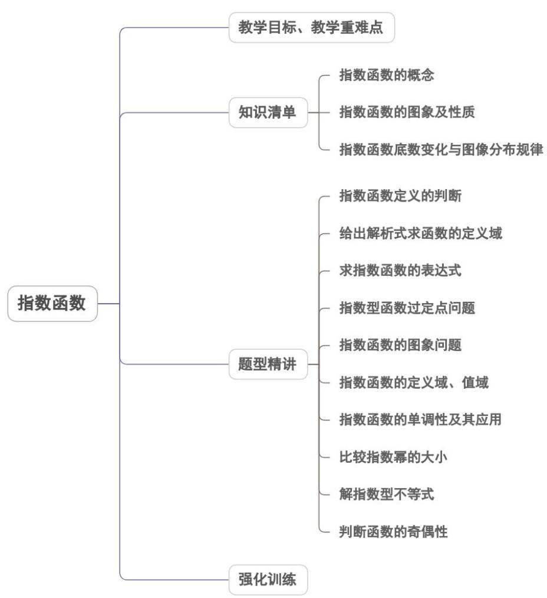
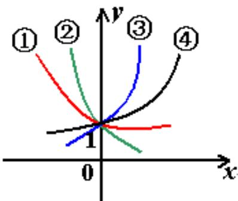
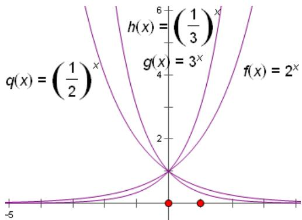
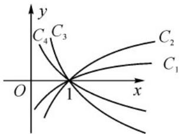
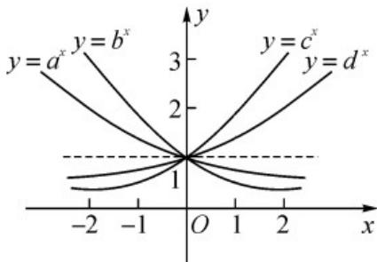

<!-- source-part:1 pages:1-50 -->

## 专题4.2 指数函数

## 内容概览

## 教学目标、教学重难点

<table><tr><td>教学目标</td><td>1.了解指数函数,掌握指数函数的形式及条件,会根据底数区分两类函数。2.掌握指数函数的图象与性质,能根据指数函数的性质进行方程、不等式的求解,比较大小,及函数的单调区间的求解、会求与指数函数相关的函数的定义域、值域。3.能解决与指数函数有关的综合性问题。</td></tr><tr><td>教学重难点</td><td>1.重点:会求复合函数的定义域、值域、单调区间,能解决与指数函数有关的实际问题及综合问题.2.难点:掌握指数函数的图象与性质,并能利用指数函数的性质进行大小的比较、解指数方程与不等式</td></tr></table>

## 知识清单

## 知识点 01 指数函数的概念:

函数 $y = a^{x}$ （ $a > 0$ 且 $a \neq 1$ ）叫做指数函数，其中 $x$ 是自变量， $a$ 为常数，函数定义域为 $R$ ：

【即学即练】

1. 已知函数 $f(x) = \begin{cases} (2a + 1)^x, & x \leq 1, \\ \frac{1}{4x}, & x > 1, \end{cases}$ 在 $\mathbf{R}$ 上单调递减，则实数 $a$ 的取值范围为 \_\_\_\_.

【答案】 $\left[-\frac{3}{8},0\right)$

【详解】因为 是 上的减函数，所以 $\left\{\begin{aligned}0&<2a+1<1\\ (2a+1)^{1}&\frac{1}{4\times1}\end{aligned}\right.$ ，解得 $\left\{\begin{aligned}-\frac{1}{2}<a<0\\ a&-\frac{3}{8}\end{aligned}\right.$

所以 $a$ 的取值范围是 $\left[-\frac{3}{8},0\right)$

故答案为： $\left[-\frac{3}{8},0\right)$ .

2．已知函数 $y = f(x)$ ，满足 $f(x) + 2f(3 - x) = 2^{x}$ ，则 $f(1) = \_\_\_\_$ .

【答案】2

【详解】由 $f(x)+2f(3-x)=2^{x}$ ①，

用 3-x 替换 x ，得 $f(3-x)+2f(x)=2^{3-x}$ ②，

$$
② \times 2 - ①, \text {得} 3 f (x) = 2 \times 2 ^ {3 - x} - 2 ^ {x}, \text {得} f (x) = \frac {2}{3} \times 2 ^ {3 - x} - \frac {2 ^ {x}}{3}.
$$

所以， $f(1) = \frac{2}{3}\times 2^2 -\frac{2}{3} = 2$

故答案为：2

知识点 02 指数函数的图象及性质:

<table><tr><td colspan="3"> $y = a^x$ </td></tr><tr><td></td><td>0 &lt; a &lt; 1时图象</td><td>a &gt;1时图象</td></tr><tr><td>图象</td><td></td><td></td></tr><tr><td rowspan="6">性质</td><td colspan="2">1定义域R,值域(0,+∞)</td></tr><tr><td colspan="2">2 $a^0=1$ ,即x=0时, $y=1$ ,图象都经过(0,1)点</td></tr><tr><td colspan="2">3 $a^x=a$ ,即x=1时, $y$ 等于底数a</td></tr><tr><td>4在定义域上是单调减函数</td><td>4在定义域上是单调增函数</td></tr><tr><td>5x&lt;0时, $a^x>1$ x&gt;0时, $0 < a^x < 1$ </td><td>5x&lt;0时, $0 < a^x < 1$ x&gt;0时, $a^x>1$ </td></tr><tr><td colspan="2">6既不是奇函数,也不是偶函数</td></tr></table>

## 【即学即练】

1. 已知函数 $f(x) = \begin{cases} (a - 2)^{x - 3}, & x \leq 4 \\ x^2 - ax + 2, & x > 4 \end{cases}$ 在定义域 $\mathbf{R}$ 上为增函数，则实数 $a$ 的取值范围为（）

【答案】C

【详解】由函数 $f(x) = \begin{cases} (a - 2)^{x - 3}, & x \leq 4, \\ x^2 - ax + 2, & x > 4 \end{cases}$ 在定义域 $\mathbf{R}$ 上为增函数，则满足 $\left\{ \begin{array}{ll} a - 2 > 1\\ \frac{a}{2} \leq 4\\ 16 - 4a + 2 & a - 2 \end{array} \right.$ ，解得 $3 < a \leq 4$ ，即实数的取值范围为 $(3,4]$

故选：C.

2. 已知函数 $f(x)$ 的定义域为 $\mathbf{R}$ ，且 $f(x + 1)$ 为奇函数，当 $x < 1$ 时， $f(x) = e^x - e$ ，则关于 $a$ 的不等式 $f(a^2 - a - 1) = 0$ 的解集为（）

【答案】C

【详解】依题意，因为 $f(x + 1)$ 为奇函数，所以函数 $f(x)$ 的图像关于 $(1,0)$ 对称，又当 $x < 1$ 时， $f(x) = e^{x} - e^{-x}$ ，易知函数 $f(x)$ 在 $(-\infty, 1)$ 上单调递增，所以当 $x = 1$ 时，函数 $f(x)$ 在 $[1, +\infty)$ 上单调递增，

又 $f(1) = 0$ ，可知 $f(x)$ 在 $\mathbf{R}$ 上单调递增，

所以 $f\left(a^{2} - a - 1\right)$ 0可化为 $f\left(a^{2} - a - 1\right)$ $f(1)$

即 $a^2 - a - 1 \quad 1$ ，即 $a^2 - a - 2 \quad 0$ ，解得 $a \leq -1$ 或 $a \quad 2$ ，

所以不等式的解集为 $\left(-\infty, -1\right] \cup [2, +\infty)$ .

故选：C.

知识点 03 指数函数底数变化与图像分布规律

(1)

① $y = a^{x}$ ，② $y = b^{x}$ ，③ $y = c^{x}$ ，④ $y = d^{x}$ ，则： $0 < b < a < 1 < d < c$

又即： $x\in (0, + \infty)$ 时， $b^{x} <   a^{x} <   d^{x} <   c^{x}$ （底大幂大） $x\in (-\infty ,0)$ 时， $b^{x} > a^{x} > d^{x} > c^{x}$

(2) 特殊函数

$y=2^{x}$ ， $y=3^{x}$ ， $y=(\frac{1}{2})^{x}$ ， $y=(\frac{1}{3})^{x}$ 的图像：

## 【即学即练】

1. 如图，曲线是对数函数 $y = \log_a x$ 图象，已知 $a$ 的取值分别为 $\sqrt{3}, \sqrt{2}, \frac{3}{5}, \frac{2}{5}$ ，则相应的曲线 $C_1, C_2, C_3, C_4$ 对应

的 $a$ 的值依次为（）

A $\frac{2}{5},\frac{3}{5},\sqrt{2},\sqrt{3}$ B $\sqrt{3},\sqrt{2},\frac{3}{5},\frac{2}{5}$ C $\sqrt{3},\sqrt{2},\frac{2}{5},\frac{3}{5}$ D $\sqrt{2},\sqrt{3},\frac{3}{5},\frac{2}{5}$

【答案】B

【详解】解法 $^{1}$ 对数函数的曲线在第一象限部分，随着底数a的增大而逆时针旋转，故 $a_{1}>a_{2}>a_{3}>a_{4}$ ．即

只有 $B$ 符合.

解法2 取 $y = 1$ 知 $a = x$ ，直线 $y = 1$ 与四条曲线交点的横坐标满足 $x_{1} > x_{2} > x_{3} > x_{4}$ ，得 $a_{1} > a_{2} > a_{3} > a_{4}$ 。故 $B$

符合.

2．若指数函数 $y = a^{x}, y = b^{x}, y = c^{x}, y = d^{x}$ 的图象如图所示，则1，a，b，c，d由小到大的顺序是（）

【答案】

A. $a < b < 1 < c < d$ B. $b < a < 1 < d < c$ C. $1 < a < b < d < c$ D. $a < b < 1 < d < c$

【答案】B

【详解】利用特值法求解，取 $x = 1$ ，可知 $b < a < 1 < d < c$

## 题型精讲

![[高中/课堂同步/题库/人教A版高中数学同步讲义(2026)/01_必修第一册/第四章 指数函数与对数函数/专题4.2 指数函数（高效培优讲义）/题型01_指数函数定义的判断/题型01_指数函数定义的判断.md]]
![[高中/课堂同步/题库/人教A版高中数学同步讲义(2026)/01_必修第一册/第四章 指数函数与对数函数/专题4.2 指数函数（高效培优讲义）/题型02_利用指数函数的定义求参数/题型02_利用指数函数的定义求参数.md]]
![[高中/课堂同步/题库/人教A版高中数学同步讲义(2026)/01_必修第一册/第四章 指数函数与对数函数/专题4.2 指数函数（高效培优讲义）/题型03_求指数函数的表达式/题型03_求指数函数的表达式.md]]
![[高中/课堂同步/题库/人教A版高中数学同步讲义(2026)/01_必修第一册/第四章 指数函数与对数函数/专题4.2 指数函数（高效培优讲义）/题型04_指数型函数过定点问题/题型04_指数型函数过定点问题.md]]
![[高中/课堂同步/题库/人教A版高中数学同步讲义(2026)/01_必修第一册/第四章 指数函数与对数函数/专题4.2 指数函数（高效培优讲义）/题型05_指数函数的图象问题/题型05_指数函数的图象问题.md]]
![[高中/课堂同步/题库/人教A版高中数学同步讲义(2026)/01_必修第一册/第四章 指数函数与对数函数/专题4.2 指数函数（高效培优讲义）/题型06_指数函数的定义域_值域/题型06_指数函数的定义域_值域.md]]
![[高中/课堂同步/题库/人教A版高中数学同步讲义(2026)/01_必修第一册/第四章 指数函数与对数函数/专题4.2 指数函数（高效培优讲义）/题型07_指数函数的单调性及其应用/题型07_指数函数的单调性及其应用.md]]
![[高中/课堂同步/题库/人教A版高中数学同步讲义(2026)/01_必修第一册/第四章 指数函数与对数函数/专题4.2 指数函数（高效培优讲义）/题型08_比较指数幂的大小/题型08_比较指数幂的大小.md]]
![[高中/课堂同步/题库/人教A版高中数学同步讲义(2026)/01_必修第一册/第四章 指数函数与对数函数/专题4.2 指数函数（高效培优讲义）/题型09_解指数型不等式/题型09_解指数型不等式.md]]
![[高中/课堂同步/题库/人教A版高中数学同步讲义(2026)/01_必修第一册/第四章 指数函数与对数函数/专题4.2 指数函数（高效培优讲义）/题型10_判断函数的奇偶性/题型10_判断函数的奇偶性.md]]
![[高中/课堂同步/题库/人教A版高中数学同步讲义(2026)/01_必修第一册/第四章 指数函数与对数函数/专题4.2 指数函数（高效培优讲义）/强化训练/强化训练.md]]
