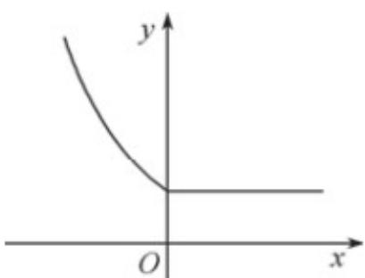

> [!faq]- 《专题4.2 指数函数（高效培优讲义）》官方解析
>
> > [!success]- **【答案】** A. $(-\infty, -1]$ B. $(0, +\infty)$ C. $(-1, 0)$ D. $(-\infty, 0)$
>
> > [!note]- **【解析】**
> > 当 $x \leq 0$ 时，函数 $f(x) = 2^{-x}$ 是减函数，则 $f(x) \geq f(0) = 1$ 。作出 $f(x)$ 的大致图象如图所示，结合图象可知，要使 $f(x + 1) < f(2x)$ ，则需 $\left\{ \begin{array}{l} x + 1 < 0, \\ 2x < 0, \\ 2x < x + 1 \end{array} \right.$ 或 $\left\{ \begin{array}{ll} x + 1 & 0, \\ 2x < 0, \end{array} \right.$ 所以 $x < 0$ 。
> >
> > 
