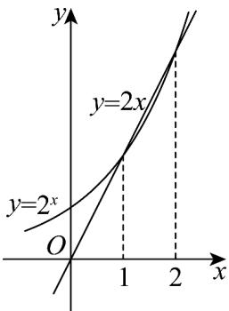

> [!faq]- 《专题4.2 指数函数（高效培优讲义）》官方解析
>
> > [!success]- **【答案】** BC
>
> > [!note]- **【解析】**
> > 由 $\left|f(x)-g(x)\right|=\left|2^{x}-2x+1\right|\leq1$ 可得 $-1\leq2^{x}-2x+1\leq1$ ，故 $2x-2\leq2^{x}\leq2x$
> >
> > 当 $x \in \left[\frac{1}{2}, 1\right]$ 时， $2^{\frac{1}{2}} - 2 \times \frac{1}{2} \leq 0$ 不成立，故 A 错误，
> >
> > 当 $x \in \left[2, \frac{5}{2}\right]$ 时， $2^{\frac{5}{2}} - 2 \times \frac{5}{2} = 4\sqrt{2} - 5 \leq 0$ 不成立，故 D 错误，
> >
> > 当 $x \in [1,2]$ 时，由于指数函数 $y = 2^x$ 与直线 $y = 2x$ 至多两个交点，且 $x = 1$ 时， $2^1 = 2 \times 1$ ， $x = 2$ 时， $2^2 = 2 \times 2$
> >
> > 结合函数图象可知：当 $x \in [1,2]$ 时， $2^x \leq 2x$ 成立，
> >
> > 而当 $x \in [1, 2]$ 时， $y = 2x - 2$ 的最大值为 $2$ ， $y = 2^x$ 的最小值为 $2$ ，故 $2x - 2 \leq 2^x$ ，
> >
> > 综上可知对任意的 $x \in [1,2]$ 都有 $2x - 2 \leq 2^x \leq 2x$
> >
> > 故 $[1,2]$ 是 $f(x) = 2^{x} - 1$ 与 $g(x) = 2x - 2$ 的“密接区间”，故BC正确，
> >
> > 故选：BC
> >
> > 
