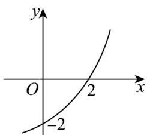

> [!faq]- 《专题4.2 指数函数（高效培优讲义）》官方解析
>
> > [!success]- **【答案】**  A. $2\sqrt{2} - 2$ B. $\frac{\sqrt{3}}{9} -3$ C. $3\sqrt{3} -3$ D. $3\sqrt{3} -3$ 或 $-3\sqrt{3} -3$
>
> > [!note]- **【解析】**
> > 由题中图象知，函数过 $(0,-2)$ ， $(2,0)$ ，则 $f(0)=1+b=-2$ ，所以b=-3。又 $f(2)=a^{2}-3=0$ ，所以 $a=\sqrt{3}$ （负值舍去），故 $f(x)=(\sqrt{3})^{x}-3$ ，
> > ∴ $f(3)=3\sqrt{3}-3$
> >
> > 故选 $C$
