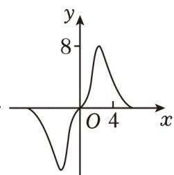
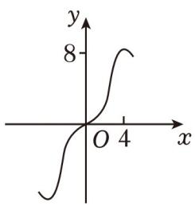
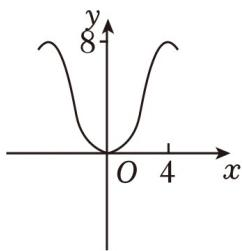
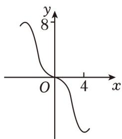

<!-- question-source:start -->
【变式1】我国著名数学家华罗庚先生曾说：“数缺形时少直观，形缺数时难入微”·在数学的学习和研究过程

中，常用函数图像来研究函数的性质，也经常用函数解析式来分析函数的图像特征，函数 $y = \frac{2x^3}{2^x + 2^{-x}}$ 在

$[-6,6]$ 的图像大致为（）

A

B

C

D

<!-- question-source:end -->

![[高中/课堂同步/题库/人教A版高中数学同步讲义(2026)/01_必修第一册/第四章 指数函数与对数函数/专题4.2 指数函数（高效培优讲义）/题型05_指数函数的图象问题/questions/answers/Q00075524A1.md]]
