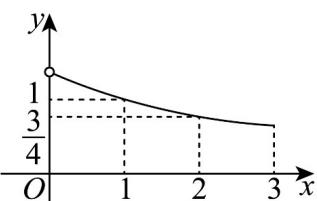

<!-- question-source:start -->
【变式3】已知函数 $f(x)$ 是定义在 $[-3,0)\cup (0,3]$ 上的奇函数，当 $x\in (0,3]$ 时， $f(x)$ 的图象如图所示，那么满

足不等式 $f(x)\geqslant 2^{x} - 1$ 的 $x$ 的取值范围是（）

A $[-3, - 2]\cup [2,3]$ B $[-3, - 2]\cup (0,1]$

C $[-2,0)\cup [1,3]$ D $[-1,0)\cup (0,1]$
<!-- question-source:end -->

![[高中/课堂同步/题库/人教A版高中数学同步讲义(2026)/01_必修第一册/第四章 指数函数与对数函数/专题4.2 指数函数（高效培优讲义）/题型05_指数函数的图象问题/questions/answers/Q00075526A1.md]]
