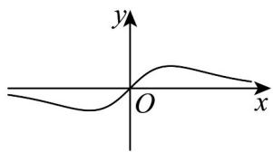
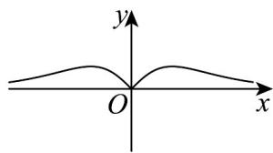
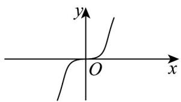
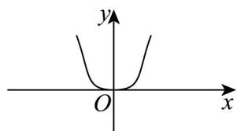

> [!faq]- 《专题4.2 指数函数（高效培优讲义）》官方解析
>
> > [!success]- **【答案】** A  B  C.  D 
>
> > [!note]- **【解析】**
> > 由 $f(-x)=\frac{-2x}{e^{-x}+e^{x}}=-\frac{2x}{e^{x}+e^{-x}}=-f(x)$ ，且定义域为 R，故 $f(x)$ 为奇函数，排除 B、D；
> >
> > $x \to +\infty$ 时， $2x, e^x + e^{-x}$ 都趋向于 $+\infty$ ，且 $e^x + e^{-x}$ 增长快于 $2x$ ，所以 $f(x)$ 趋向于0，排除C.
> >
> > 故选 **A**
