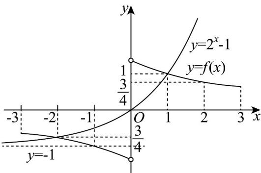

> [!faq]- 《专题4.2 指数函数（高效培优讲义）》官方解析
>
> > [!success]- **【答案】** B
>
> > [!note]- **【解析】**
> > 函数 $f(x)$ 是定义在 $[-3,0) \cup (0,3]$ 上的奇函数，则函数 $f(x)$ 的图象关于原点对称，作出函数 $f(x)$ 在 $[-3,0)$ 上的图象，并在此坐标系中作出函数 $y = 2^x - 1$ 的图象，如图，
> >
> > 
> >
> > 函数 $f(x)$ 的图象与函数 $y = 2^{x} - 1$ 的图象交于点 $(-2, -\frac{3}{4}), (1, 1)$
> >
> > 观察图象知，当 $-3 \leq x \leq -2$ 或 $0 < x \leq 1$ 时，函数 $f(x)$ 的图象不在函数 $y = 2^x - 1$ 的图象下方，
> >
> > 即当 $-3 \leq x \leq -2$ 或 $0 < x \leq 1$ 时，不等式 $f(x) \geqslant 2^{x} - 1$ 成立，
> >
> > 所以不等式 $f(x) \geqslant 2^{x} - 1$ 的 $x$ 的取值范围是 $[-3, -2] \cup (0, 1]$ .
> >
> > 故选 **B**
