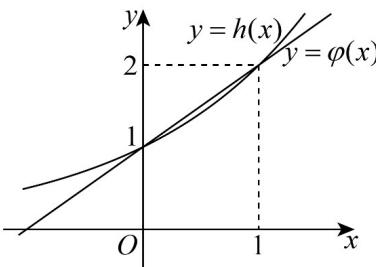

> [!faq]- 《专题4.2 指数函数（高效培优讲义）》官方解析
>
> > [!success]- **【答案】** A. $(- \infty, -1)$ B. $[1, +\infty)$ C. $\left[\frac{1}{2}, +\infty\right)$ D. $[1, 3)$
>
> > [!note]- **【解析】**
> > 由对于任意的 $x_{1}, x_{2} \in \mathbf{R}(x_{1} \neq x_{2})$ 都有 $(x_{2} - x_{1})(f(x_{2}) - f(x_{1})) < 0$
> >
> > 可知函数 $f(x)$ 在 R 上单调递减.
> >
> > 由函数 $g(x)=2^{|x-m|}$ 的图象关于直线 x=m 对称，
> >
> > 知函数 $g(x)$ 的单调递减区间为 $(-\infty, m)$ ，单调递增区间为 $(m, +\infty)$ .
> >
> > 二次函数 $y = -x^{2} + (1 - 2m)x + m + 1$ 的对称轴为 $x = \frac{1 - 2m}{2}$ 若函数 单调递减，必有 $\left\{\begin{aligned}&m&0\\ &\frac{1-2m}{2}\leq0\\ &2^{|0-m|}&-0^{2}+(1-2m)\times0+m+1\end{aligned}\right.$ ，可得 $\left\{\begin{aligned}&m&\frac{1}{2}\\ &2^{|m|}&m+1\end{aligned}\right.$ 当 $m \frac{1}{2}$ 时，不等式 $2^{|m|} \quad m+1$ 可化为 $2^{m} \quad m+1$ 在平面直角坐标系中画出函数 $h(x)=2^{x}, \varphi(x)=x+1$ 的图象，
> >
> > 
> >
> > 又由 $h(0)=\varphi(0)=1, h(1)=\varphi(1)=2$
> >
> > 由图象可知不等式 $2^{m}$ $m+1$ 的解集为 m 1，
> >
> > 故实数 m 的取值范围为 $\left[1, +\infty\right)$ .
> >
> > 故选 **B**
