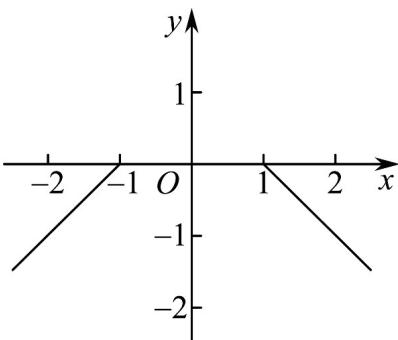

> [!faq]- 《专题4.2 指数函数（高效培优讲义）》官方解析
>
> > [!success]- **【答案】** BCD
>
> > [!note]- **【解析】**
> > 选项A，令 $\frac{1 + x}{1 - x} = 0$ ，则 $\left\{ \begin{array}{ll}(1 + x)(1 - x) & 0\\ 1 - x\neq 0 & 0 \end{array} \right.$ ，解得 $-1\leq x <   1$
> >
> > 所以函数 $f_{1}(x)$ 的定义域是 $[-1, 1)$ ，定义域不关于原点对称，故不具有奇偶性；
> >
> > 选项B，为使函数 $f_{2}(x)$ 的分子有意义， $x\in \left[-\sqrt{3},\sqrt{3}\right]$ ，于是 $x - 3 <   0$ 恒成立，
> >
> > 故 $f_{2}(x) = \frac{\sqrt{3 - x^{2}}}{3 - x - 3} = -\frac{\sqrt{3 - x^{2}}}{x}, x \in [-\sqrt{3}, 0) \cup (0, \sqrt{3}]$
> >
> > 因为 $f_{2}(-x)=\frac{\sqrt{3-x^{2}}}{x}=-f_{2}(x)$
> >
> > 故 $f_{2}(x)$ 是奇函数；
> >
> > 选项C，函数 $f_{3}(x)$ 的定义域是 $\{x, x \neq 0\}$ ， $f_{3}(x) = \frac{1}{2^{x} - 1} + \frac{1}{2} = \frac{2 + 2^{x} - 1}{2(2^{x} - 1)} = \frac{1}{2} \cdot \frac{2^{x} + 1}{2^{x} - 1}$
> >
> > $$
> > f _ {3} (- x) = \frac {1}{2} \cdot \frac {2 ^ {- x} + 1}{2 ^ {- x} - 1} = \frac {1}{2} \cdot \frac {1 + 2 ^ {x}}{1 - 2 ^ {x}} = - f _ {3} (x)
> > $$
> >
> > 故 $f_{3}(x)$ 为奇函数；
> >
> > 选项D，画出 $f_{4}(x) = \left\{ \begin{array}{ll}x + 1, & x <   - 1\\ 0, & -1\leq x\leq 1\\ -x + 1,x > 1 \end{array} \right.$ 的图象，如图，图象关于y轴对称，
> >
> > 
> >
> > 故 $f_{4}(x)$ 为偶函数·
> >
> > 故选：BCD
> >
> > ## 方法技巧
> >
> > 利用奇偶性的性质求解.
