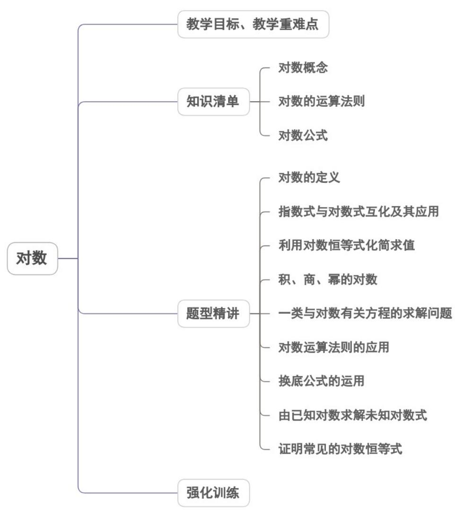
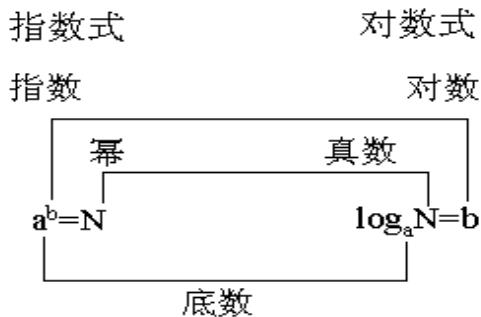

<!-- source-part:1 pages:1-45 -->

<table><tr><td>教学目标</td><td>1.理解对数的概念、掌握对数的性质。2.掌握指数式与对数式的互化,能进行简单的对数运算。3.理解对数的运算性质和换底公式,能熟练运用对数的运算性质进行化简求值。4.能利用对数的运算性质进行解方程及与指、幂函数的综合应用问题的解决。</td></tr></table>

## 专题4.3 对数

## 内容概览

## 教学目标、教学重难点

<table><tr><td>教学重难点</td><td>1.重点:掌握对数的概念及对数条件2.难点:熟练掌握指对数形式的互化,准确利用对数的运算法则进行对数式子的化简与运算,会解决与对数相关的综合问题.</td></tr></table>

## 知识清单

## 知识点 01 对数概念

## 1、对数的概念

如果 $a^b = N(a > 0$ ，且 $a \neq 1)$ ，那么数 $b$ 叫做以 $a$ 为底 $N$ 的对数，记作： $\log_a N = b$ 。其中 $a$ 叫做对数的底数， $N$ 叫做真数。

2、对数 $\log_a N$ （ $a > 0$ 且 $a \neq 1$ ）具有下列性质：

(1) 0 和负数没有对数，即 N > 0；

(2) 1 的对数为 0，即 $\log_{a}1 = 0$ ；

(3) 底的对数等于 1，即 $\log_a a = 1$

## 3、两种特殊的对数

通常将以 10 为底的对数叫做常用对数， $\log_{10}N$ 简记作 $\lg N$ 。以 $e(e$ 是一个无理数， $e=2.7182\cdots$ ）为底的对数叫做自然对数， $\log_{e}N$ 简记为 $\ln N$ 。

## 4、对数式与指数式的关系

由定义可知：对数就是指数变换而来的，因此对数式与指数式联系密切，且可以互相转化。它们的关系可由

下图表示.

由此可见 $a, b, N$ 三个字母在不同的式子中名称可能发生变化。

【即学即练】

1. 已知函数 $f(x)$ 为 $\mathbf{R}$ 上的偶函数，对任意 $x_{1}, x_{2} \in (0, +\infty)$ ，均有 $\frac{f(x_1) - f(x_2)}{x_1 - x_2} < 0$ 成立，若 $a = f(\sqrt{2})$ ，

$b = f\left(\log_{2}\frac{1}{4}\right)$ , $c = f\left(\mathrm{e}^{\frac{1}{3}}\right)$ ，则 $a, b, c$ 的大小关系为（ ）
A. $b < a < c$ B. $a < b < c$ C. $c < b < a$ D. $b < c < a$

【答案】A

【详解】因为函数 $f(x)$ 为R上的偶函数，则 $b = f\left(\log_2\frac{1}{4}\right) = f(-2) = f(2)$ ，

且 $8 > \mathrm{e}^2$ ，则 $\left(2^{3}\right)^{\frac{1}{6}} > \left(\mathrm{e}^{2}\right)^{\frac{1}{6}}$ ，即 $\sqrt{2} >\mathrm{e}^{\frac{1}{3}}$ ，可得 $\mathrm{e}^{\frac{1}{3}} <   \sqrt{2} <  2$

又因为对任意 $x_{1}$ ， $x_{2}\in(0,+\infty)$ ，均有 $\frac{f(x_{1})-f(x_{2})}{x_{1}-x_{2}}<0$ 成立，

可知 $f(x)$ 在 $(0, +\infty)$ 内单调递减，则 $f\left(\mathrm{e}^{\frac{1}{3}}\right) > f\left(\sqrt{2}\right) > f(2)$ ，即 $c > a > b$

故选：A.

2. 某企业研发一款新产品，计划第一年投入研发经费 $^{10}$ 万元，此后每年投入的研发经费比上一年增长 $^{20\%}$ .
若第 $n(n \in \mathbf{N}_{+})$ 年的投入的研发经费首次超过 $^{20}$ 万元，则 $n = (\quad)$

(参考数据： $\lg2\approx0.301,\lg3\approx0.477$ )
A. 4 B. 5 C. 7 D. 8

【答案】B

【详解】由题意可得 $10\left(1 + 20\%\right)^{n - 1} > 20$ ，即 $1.2^{n - 1} > 2$

两边同时取以 $^{10}$ 为底的对数，则有 $(n-1)\lg 1.2 > \lg 2$

所以 $n-1>\frac{\lg2}{\lg1.2}=\frac{\lg2}{2\lg2+\lg3-1}\approx\frac{0.301}{0.079}\approx3.81$

解得 n > 4.81 ，因为 $n \in N_{+}$ ，所以 n = 5。

故选：B

## 知识点 02 对数的运算法则

已知 $\log_a M$ ， $\log_a N$ （ $a > 0$ 且 $a \neq 1$ ， $M$ 、 $N > 0$ ）

（1）正因数的积的对数等于同一底数各个因数的对数的和； $\log_{a}(MN)=\log_{a}M+\log_{a}N$ 推广： $\log_{a}\left(N_{1}N_{2}\cdots N_{k}\right)=\log_{a}N_{1}+\log_{a}N_{2}+\cdots+\log_{a}N_{k}\left(N_{1},N_{2},\cdots,N_{k}>0\right)$

(2) 两个正数的商的对数等于被除数的对数减去除数的对数； $\log_a\frac{M}{N} = \log_aM - \log_aN$

(3) 正数的幂的对数等于幂的底数的对数乘以幂指数； $\log_a M^\alpha = \alpha \log_a M$

## 【即学即练】

1. 已知正实数 $a$ ， $b$ 满足 $ab^2 = 10^4$ ， $m = \lg a$ ， $n = \lg b$ ，则 $mn$ 的最大值是（）

【答案】
A. 1 B. 2 C. 4 D. 8

【答案】B

【详解】由题设 $a = \frac{10^4}{b^2}$ ，可得 $m = \lg \frac{10^4}{b^2} = 4 - 2\lg b$

所以 $mn = (4 - 2 \lg b) \lg b = -2 (\lg b - 1)^{2} + 2$

当 a=100，b=10 时，mn 的最大值是 2.

故选：B

2. 设 $a = \log_4 3, b = \log_5 4, c = \log_6 5$ ，则 $a, b, c$ 的大小关系为（）A. $a > b > c$ B. $c > b > a$ C. $a > c > b$ D. $c > a > b$

【答案】B

【详解】比较 $a = \log_43$ 和 $b = \log_54$ ，采用作差法，将 $\log_43$ 和 $\log_54$ 转化为同底数形式来比较利用换底公式，则 $\log_43 = \frac{\ln 3}{\ln 4}$ $\log_54 = \frac{\ln 4}{\ln 5}$ .

计算 $\log_43 - \log_54 = \frac{\ln 3}{\ln 4} -\frac{\ln 4}{\ln 5} = \frac{\ln 3\ln 5 - (\ln 4)^2}{\ln 4\ln 5}$

根据基本不等式，对于 $\ln3$ 和 $\ln5$ ，有 $\sqrt{\ln3\ln5} \leq \frac{\ln3 + \ln5}{2}$

而 $\frac{\ln 3 + \ln 5}{2} = \frac{\ln(3\times 5)}{2} = \frac{\ln 15}{2} <  \frac{\ln 16}{2} = \ln 4$ ，即 $\ln 3\ln 5 <   (\ln 4)^2$

所以 $\frac{\ln3\ln5-(\ln4)^{2}}{\ln4\ln5}<0$ ，也就是 $\log_{4}3<\log_{5}4$ ，即 a<b.

比较 b 与 c 的大小，同样利用换底公式， $b = \log_{5} 4 = \frac{\ln 4}{\ln 5}$ ， $c = \log_{6} 5 = \frac{\ln 5}{\ln 6}$ .

计算 $\log_{5}4-\log_{6}5=\frac{\ln4}{\ln5}-\frac{\ln5}{\ln6}=\frac{\ln4\ln6-(\ln5)^{2}}{\ln5\ln6}$

由基本不等式，对于 $\ln 4$ 和 $\ln 6$ ， $\sqrt{\ln 4 \ln 6} \leq \frac{\ln 4 + \ln 6}{2}$ .

且 $\frac{\ln 4 + \ln 6}{2} = \frac{\ln(4\times 6)}{2} = \frac{\ln 24}{2} <  \frac{\ln 25}{2} = \ln 5$ ，即 $\ln 4\ln 6 <   (\ln 5)^2$

所以 $\frac{\ln4\ln6-(\ln5)^{2}}{\ln5\ln6}<0$ ，也就是 $\log_{5}4<\log_{6}5$ ，即 b<c·

综上可得 $a < b < c$

故选：B.

## 知识点 03 对数公式

1、对数恒等式：

$$
\left. \begin{array}{l} a ^ {b} = N \\ \log_ {a} N = b \end{array} \right\} \Rightarrow a ^ {\log_ {a} N} = N
$$

2、换底公式

同底对数才能运算，底数不同时可考虑进行换底，在 $a > 0$ ， $a\neq 1$ ， $M > 0$ 的前提下有：

(1) $\log_a M = \log_{a^n} M^n (n \in R)$

令 $\log_a M = b$ ，则有 $a^b = M$ ， $(a^b)^n = M^n$ ，即 $(a^n)^b = M^n$ ，即 $b = \log_{a^n} M^n$ ，即： $\log_a M = \log_{a^n} M^n$

$\log_{a}M=\frac{\log_{c}M}{\log_{c}a}\quad(c>0,c\neq1)$ ，令 $\log_{a}M=b$ ，则有 $a^{b}=M$ ，则有 $\log_{c}a^{b}=\log_{c}M(c>0,c\neq1)$

即 $b \cdot \log_{c} a = \log_{c} M$ ，即 $b = \frac{\log_{c} M}{\log_{c} a}$ ，即 $\log_{a} M = \frac{\log_{c} M}{\log_{c} a} (c > 0, c \neq 1)$

## 当然，细心一些的同学会发现（1）可由（2）推出，但在解决某些问题（1）又有它的灵活性．而且由（2）

$\log_a b = \frac{1}{\log_b a} (a > 0, a \neq 1, b > 0, b \neq 1)$ 还可以得到一个重要的结论：

## 【即学即练】

1. 用计算器计算可知： $\log_3 6 > \log_2 3$ ，则 $\log_3 2$ 的值所在的区间为（）

【答案】

A. $\left(0, \frac{1}{2}\right)$ B. $\left(\frac{1}{2}, \frac{\sqrt{5} - 1}{2}\right)$ C. $\left(\frac{\sqrt{5} - 1}{2}, \frac{2}{3}\right)$ D. $\left(\frac{2}{3}, 1\right)$

【答案】C

【详解】因为 $2^{3}<3^{2}$ ，所以 $\log_{3}2^{3}<\log_{3}3^{2}$ ，即 $3\log_{3}2<2$ ，所以 $\log_{3}2<\frac{2}{3}$ ，

设 $t = \log_32$ ，又因为 $\log_32 > \log_31 = 0$ ，所以 $0 < t < \frac{2}{3}$

由对数加法公式得： $\log_{3}6=\log_{3}2+\log_{3}3=\log_{3}2+1$

由对数换底公式得： $\log_23 = \frac{\log_33}{\log_32} = \frac{1}{\log_32}$

所以 $\log_36 > \log_23$ 可化为： $t + 1 > \frac{1}{t}$

即 $t^2 + t - 1 > 0$ ，解得 $t < \frac{-1 - \sqrt{5}}{2}$ 或 $t > \frac{\sqrt{5} - 1}{2}$

又因为 $0 < t < \frac{2}{3}$ ，所以 $\frac{\sqrt{5} - 1}{2} < t < \frac{2}{3}$

即 $\log_32$ 的值所在的区间为 $\left(\frac{\sqrt{5} - 1}{2},\frac{2}{3}\right)$

故选：C

2. 使式子 $\log_{(2x-1)}\frac{1}{2-x}$ 有意义的 $x$ 的取值范围是（ ）A. $(2,+\infty)$ B. $\left(\frac{1}{2},2\right)$ C. $(- \infty,2)$ D. $\left(\frac{1}{2},1\right) \cup (1,2)$

【答案】D

【详解】要使式子 $\log_{(2x - 1)}\frac{1}{2 - x}$ 有意义，

则 $\left\{\begin{aligned}&2x-1>0\\ &2x-1\neq1\\ &2-x>0\end{aligned}\right.$ ，即 $\left\{\begin{aligned}&x>\frac{1}{2}\\ &x\neq1\\ &x<2\end{aligned}\right.$

解得 $\frac{1}{2} < x < 1$ 或 $1 < x < 2$ ，

所以 x 的取值范围是 $\left(\frac{1}{2},1\right)\cup(1,2)$ .

故选：D

## 题型精讲

![[高中/课堂同步/题库/人教A版高中数学同步讲义(2026)/01_必修第一册/第四章 指数函数与对数函数/专题4.3 对数（高效培优讲义）/题型01_对数的定义/题型01_对数的定义.md]]
![[高中/课堂同步/题库/人教A版高中数学同步讲义(2026)/01_必修第一册/第四章 指数函数与对数函数/专题4.3 对数（高效培优讲义）/题型02_指数式与对数式互化及其应用/题型02_指数式与对数式互化及其应用.md]]
![[高中/课堂同步/题库/人教A版高中数学同步讲义(2026)/01_必修第一册/第四章 指数函数与对数函数/专题4.3 对数（高效培优讲义）/题型03_利用对数恒等式化简求值/题型03_利用对数恒等式化简求值.md]]
![[高中/课堂同步/题库/人教A版高中数学同步讲义(2026)/01_必修第一册/第四章 指数函数与对数函数/专题4.3 对数（高效培优讲义）/题型04_积_商_幂的对数/题型04_积_商_幂的对数.md]]
![[高中/课堂同步/题库/人教A版高中数学同步讲义(2026)/01_必修第一册/第四章 指数函数与对数函数/专题4.3 对数（高效培优讲义）/题型05_一类与对数有关方程的求解问题/题型05_一类与对数有关方程的求解问题.md]]
![[高中/课堂同步/题库/人教A版高中数学同步讲义(2026)/01_必修第一册/第四章 指数函数与对数函数/专题4.3 对数（高效培优讲义）/题型06_对数运算法则的应用/题型06_对数运算法则的应用.md]]
![[高中/课堂同步/题库/人教A版高中数学同步讲义(2026)/01_必修第一册/第四章 指数函数与对数函数/专题4.3 对数（高效培优讲义）/题型07_换底公式的运用/题型07_换底公式的运用.md]]
![[高中/课堂同步/题库/人教A版高中数学同步讲义(2026)/01_必修第一册/第四章 指数函数与对数函数/专题4.3 对数（高效培优讲义）/题型08_由已知对数求解未知对数式/题型08_由已知对数求解未知对数式.md]]
![[高中/课堂同步/题库/人教A版高中数学同步讲义(2026)/01_必修第一册/第四章 指数函数与对数函数/专题4.3 对数（高效培优讲义）/题型09_证明常见的对数恒等式/题型09_证明常见的对数恒等式.md]]
![[高中/课堂同步/题库/人教A版高中数学同步讲义(2026)/01_必修第一册/第四章 指数函数与对数函数/专题4.3 对数（高效培优讲义）/强化训练/强化训练.md]]
