<!-- source-part:1 pages:1-50 -->

## 专题4.4 对数函数

内容概览

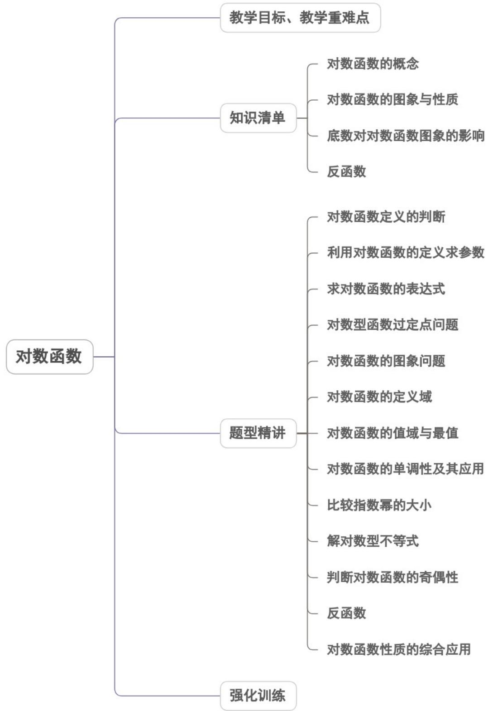

教学目标、教学重难点

<table><tr><td>教学目标</td><td>1.理解对数函数的概念及条件,掌握对数函数的图象与性质。2.会利用对数函数的性质解决与对数函数有关的函数的定义域、值域、单调性、大小比较、对数方程与不等式等相关问题。</td></tr><tr><td>教学重难点</td><td>1.重点:掌握对数函数的概念,图象及性质,利用对数函数的性质解决求函数的定义域、值域、利用单调性比较函数值的大小2.难点:会解对数方程及对数不等式,能处理与对数函数有关的函数综合问题.</td></tr></table>

## 知识清单

## 知识点 01 对数函数的概念

1、函数 $y = \log_a x (a > 0, a \neq 1)$ 叫做对数函数。其中 $x$ 是自变量，函数的定义域是 $(0, +\infty)$ ，值域为 $R$

2、判断一个函数是对数函数是形如 $y = \log_a x (a > 0, a \neq 1)$ 的形式，即必须满足以下条件：

(1) 系数为 1;

(2) 底数为大于 0 且不等于 1 的常数；

(3) 对数的真数仅有自变量 x .

## 【即学即练】

1. 下列函数中，在定义域内既是奇函数又是增函数的是（ ）A. $f(x) = 2^{-x} - 2^x$ B. $f(x) = -x(|x| - 1)$ C. $f(x) = -\frac{1}{x}$ D. $f(x) = \lg \left(x + \sqrt{x^2 + 1}\right)$

【答案】D

【详解】A，定义域为R， $f(x)+f(-x)=2^{-x}-2^{x}+2^{x}-2^{-x}=0$ ，则 $f(x)$ 为奇函数，

因 $f(1) = -\frac{3}{2}$ ， $f(0) = 0$ ，则 $f(x)$ 不是增函数，故 $\mathsf{A}$ 错误；

B，定义域为R， $f(x) + f(-x) = -x(|x| - 1) + x(|x| - 1) = 0$ ，则 $f(x)$ 为奇函数，

因 $f(1) = 0$ ， $f(0) = 0$ ，则 $f(x)$ 不是增函数，故 $\mathbf{B}$ 错误；

C，定义域为 $(- \infty, 0) \cup (0, +\infty)$ ， $f(x) + f(-x) = -\frac{1}{x} + \frac{1}{x} = 0$ ，则 $f(x)$ 为奇函数，

因 $f(1) = -1$ ， $f(-1) = 1$ ，则 $f(x)$ 不是增函数，故 $^{C}$ 错误；

D，因 $\sqrt{x^{2}+1} > |x|$ ，则 $\sqrt{x^{2}+1} + x > 0$ ，故定义域为 R，

$$
f (x) + f (- x) = \lg \left(x + \sqrt {x ^ {2} + 1}\right) + \lg \left(- x + \sqrt {x ^ {2} + 1}\right) = \lg \left[ \left(x + \sqrt {x ^ {2} + 1}\right) \left(- x + \sqrt {x ^ {2} + 1}\right) \right]
$$

$=\lg1=0$ ，则 $f(x)$ 为奇函数，

$$
\forall x _ {1}, x _ {2} \in \mathrm{R} _ {\text {且}} x _ {1} <   x _ {2}
$$

$$
f \left(x _ {1}\right) - f \left(x _ {2}\right) = \lg \left(x _ {1} + \sqrt {x _ {1} ^ {2} + 1}\right) - \lg \left(x _ {2} + \sqrt {x _ {2} ^ {2} + 1}\right) = \lg \frac {x _ {1} + \sqrt {x _ {1} ^ {2} + 1}}{x _ {2} + \sqrt {x _ {2} ^ {2} + 1}}
$$

因 $x_{1} < x_{2}$ ，则 $x_{1} - x_{2} < 0$

$$
\text {又} \sqrt {x _ {1} ^ {2} + 1} + x _ {1} > 0, \sqrt {x _ {2} ^ {2} + 1} + x _ {2} > 0
$$

$$
x _ {1} + \sqrt {x _ {1} ^ {2} + 1} - x _ {2} - \sqrt {x _ {2} ^ {2} + 1} = x _ {1} - x _ {2} + \sqrt {x _ {1} ^ {2} + 1} - \sqrt {x _ {2} ^ {2} + 1} = x _ {1} - x _ {2} + \frac {x _ {1} ^ {2} - x _ {2} ^ {2}}{\sqrt {x _ {1} ^ {2} + 1} + \sqrt {x _ {2} ^ {2} + 1}}
$$

$$
= \left(x _ {1} - x _ {2}\right) \cdot \left(1 + \frac {x _ {1} + x _ {2}}{\sqrt {x _ {1} ^ {2} + 1} + \sqrt {x _ {2} ^ {2} + 1}}\right) = \left(x _ {1} - x _ {2}\right) \cdot \frac {\sqrt {x _ {1} ^ {2} + 1} + \sqrt {x _ {2} ^ {2} + 1} + x _ {1} + x _ {2}}{\sqrt {x _ {1} ^ {2} + 1} + \sqrt {x _ {2} ^ {2} + 1}} <   0
$$

则 $x_{1} + \sqrt{x_{1}^{2} + 1} < x_{2} + \sqrt{x_{2}^{2} + 1}$ ，即 $\frac{x_1 + \sqrt{x_1^2 + 1}}{x_2 + \sqrt{x_2^2 + 1}} < 1$

则 $f(x_{1})-f(x_{2})<0$ ，即 $f(x_{1})<f(x_{2})$

则 $f(x)$ 是 $\mathbb{R}$ 上的增函数，故 ${}^{\mathrm{D}}$ 正确

故选：D

2. 下列函数中，定义域为 $\left[1, +\infty\right)$ 的是（ ）A. $f(x) = |x| + 1$ B. $f(x) = \sqrt{2^x - 1}$ C. $f(x) = \ln (x - 1)$ D. $f(x) = \frac{\sqrt{x - 1}}{x + 1}$

【答案】D

【详解】选项 A，函数 $f(x)=|x|+1$ 的定义为 R，故 A 错误；

选项 B，由 $2^{x}-1$ 0 得 x 0，故 $f(x)=\sqrt{2^{x}-1}$ 的定义域为 $[0,+\infty)$ ，故 B 错误；

选项 C，由 x-1>0 得 x>1，故 $f(x)=\ln(x-1)$ 的定义域为 $(1,+\infty)$ ，故 C 错误；

选项 D，由 $\left\{\begin{aligned}x-1&0\\ x+1&\neq0\end{aligned}\right.$ 得 x 1，故 $f(x)=\frac{\sqrt{x-1}}{x+1}$ 的定义域为 $\left[1,+\infty\right)$ ，故 D 正确，

故选：D

## 知识点 02 对数函数的图象与性质

<table><tr><td></td><td>a&gt;1</td><td>0</td></tr><tr><td>图象</td><td>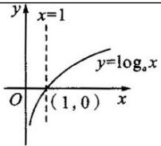</td><td>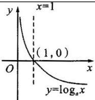</td></tr><tr><td></td><td colspan="2">定义域:(0,+∞)</td></tr><tr><td rowspan="5">性质</td><td colspan="2"></td></tr><tr><td colspan="2">值域:R</td></tr><tr><td colspan="2">过定点(1,0),即x=1时,y=0</td></tr><tr><td>在(0,+∞)上增函数</td><td>在(0,+∞)上是减函数</td></tr><tr><td>当0&lt; x&lt;1时,y&lt;0,当x 1时,y 0</td><td>当0&lt; x&lt;1时,y&gt;0,当x 1时,y≤0</td></tr></table>

## 【即学即练】

1. 已知 $f(x)$ 是定义在 $\mathbb{R}$ 上的奇函数，且当 $x > 0$ 时， $f(x) = \log_2 x + x - 3$ ，则不等式 $f(x) > 0$ 的解集是（）A. $(-2,0) \cup (2,+\infty)$ B. $(0,2) \cup (2,+\infty)$ C. $(-\infty,-2) \cup (0,2)$ D. $(-\infty,-2) \cup (0,+\infty)$

【答案】A

【详解】因为当 $x > 0$ 时， $f(x) = \log_2 x + x - 3$ ，则 $f(2) = \log_2 2 + 2 - 3 = 0$ ，且函数 $f(x)$ 在 $(0, +\infty)$ 上单调递增，则由 $f(x) > 0$ 可得 $f(x) > f(2)$ ，利用函数的单调性可得 $x > 2$ ；

又 $f(x)$ 是定义在 R 上的奇函数，故 $f(0)=0$ ；

当 $x < 0$ 时， $-x > 0$ ，则 $f(-x) = \log_2(-x) - x - 3$ ，因 $f(x) = -f(-x)$ ，则 $f(x) = -\log_2(-x) + x + 3$

函数 $f(x)$ 在 $(-\infty, 0)$ 上单调递增且 $f(-2) = -\log_2 2 - 2 + 3 = 0$

则由 $f(x)>0$ 可得 $f(x)>f(-2)$ ，利用单调性可得 -2<x<0。

综上可得，不等式 $f(x)>0$ 的解集是 $(-2,0)\cup(2,+\infty)$ .

故选：A.

2. 已知 $f(x)=\left\{\begin{aligned}&(3a-1)x-4a,x<1\\&\log_{\frac{1}{3}}x,x=1\end{aligned}\right.$ 是 R 上的单调函数，则实数 a 的取值范围是（）A. $\left[-1,\frac{1}{3}\right)$ B. $\left(-\frac{1}{3},1\right]$ C. $\left(\frac{1}{3},+\infty\right)$ D. $(-∞,-1]$

【答案】D

【详解】因为当 $x$ 1时， $f(x) = \log_{\frac{1}{3}} x$ 为减函数，且 $x = 1$ 时， $f(x) = 0$

又因为 $f(x)$ 在 $\mathbb{R}$ 上为单调函数，所以只能为单调递减函数，所以 $\left\{ \begin{array}{ll}3a - 1 <   0,\\ 3a - 1 - 4a & 0, \end{array} \right.$ 解得 $a\leq -1$ ，

故选:D.

## 知识点 03 底数对对数函数图象的影响

1、底数制约着图象的升降.

如图

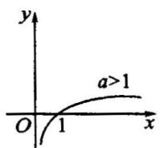

(1)

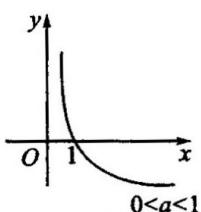

(2)

2、底数变化与图象变化的规律

在同一坐标系内，当 $a > 1$ 时，随 $a$ 的增大，对数函数的图像愈靠近 $x$ 轴；当 $0 < a < 1$ 时，对数函数的图象随 $a$

的增大而远离 $x$ 轴．（见下图）

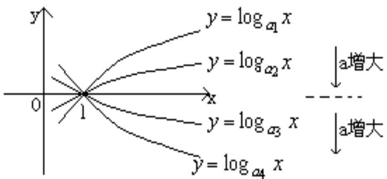
图1

【即学即练】

1. 函数 $y = \log_a x$ 的图象如图所示，则 $a$ 的值可以是（）

【答案】

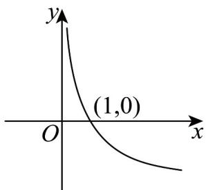

A. 0.5 B. 2 C. e D. $\pi$

【答案】A

【详解】因为函数 $y = \log_a x$ 的图象是单调递减的，所以 $0 < a < 1$ ，

由选项可知 $^{A}$ 正确·

故选：A.

2. 已知对任意 $x \in \mathbf{R}$ , $y = \sqrt{a^{|x|} - 1}$ ( $a > 0$ 且 $a \neq 1$ ) 均有意义, 则函数 $y = \log_a \frac{1}{|x|}$ 的大致图象是 ( )

【答案】

A

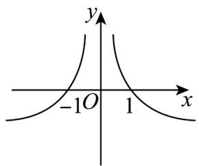

B

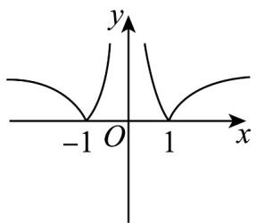

C

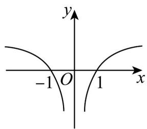

D

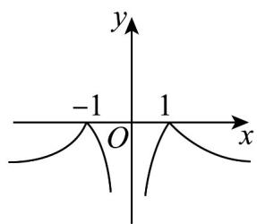

【答案】A

【详解】因为当 $x \in \mathbf{R}$ 时， $y = \sqrt{a^{|x|} - 1}$ 均有意义，所以 $a^{|x|} = 1$ ，所以 $a > 1$

当 $x > 0$ 时，令 $\mu = \frac{1}{x}$ ，可得 $\mu = \frac{1}{x}$ 在 $(0, +\infty)$ 上单调递减， $y = \log_a \mu$ 单调递增，

所以 $y = \log_a\frac{1}{x}$ 在 $(0, + \infty)$ 上单调递减，

设函数 $y = f(x) = \log_a\frac{1}{|x|}$ ，则 $f(-x) = \log_a\frac{1}{|-x|} = \log_a\frac{1}{|x|} = f(x)$

所以函数 $y = \log_{a} \frac{1}{|x|}$ 是偶函数，其图象关于 y 轴对称，故 A 符合题意

故选：A.

知识点 04 反函数

1、反函数的定义

设 $A, B$ 分别为函数 $y = f(x)$ 的定义域和值域，如果由函数 $y = f(x)$ 所解得的 $x = \varphi(y)$ 也是一个函数（即对任

意的一个 $y \in B$ ，都有唯一的 $x \in A$ 与之对应），那么就称函数 $x = \varphi(y)$ 是函数 $y = f(x)$ 的反函数，记作$x = f^{-1}(y)$ ，在 $x = f^{-1}(y)$ 中， $y$ 是自变量， $x$ 是 $y$ 的函数，习惯上改写成 $y = f^{-1}(x)$ （ $x \in B, y \in A$ ）的形式。函数 $x = f^{-1}(y)$ （ $y \in B, x \in A$ ）与函数 $y = f^{-1}(x)$ （ $x \in B, y \in A$ ）为同一函数，因为自变量的取值范围即定义域都是 $B$ ，对应法则都为 $f^{-1}$ 。由定义可以看出，函数 $y = f(x)$ 的定义域 $A$ 正好是它的反函数 $y = f^{-1}(x)$ 的值域；函数 $y = f(x)$ 的值域 $B$ 正好是它的反函数 $y = f^{-1}(x)$ 的定义域。

## 2、反函数的性质

(1) 互为反函数的两个函数的图象关于直线 y = x 对称.

（2）若函数 $y = f(x)$ 图象上有一点 $(a, b)$ ，则 $(b, a)$ 必在其反函数图象上，反之，若 $(b, a)$ 在反函数图象上，则 $(a, b)$ 必在原函数图象上。

## 【即学即练】

1. 已知函数 $f(x) = \log_2 x$ ，若函数 $g(x)$ 是 $f(x)$ 的反函数，则 $g(2)$ 等于（）A. 1 B. 2 C. 3 D. 4

【答案】D

【详解】∵ $g(x)$ 是 $f(x)$ 的反函数，∴ $g(x)=2^{x}$ ，∴ $g(2)=2^{2}=4$

故选：D

2. 已知 $a \cdot 2^{a} = b \cdot \log_{2} b = 1$ ，则下列不正确的是（）A. $2^{a} + a = b + \log_{2} b$ B. $a + b = 2^{a} + \log_{2} b$ C. $ab = 1$ D. $a + b = 2$

【答案】D

【详解】因为 $a \cdot 2^{a} = b \cdot \log_{2}b = 1$ ，所以 $2^{a} = \frac{1}{a}$ ， $\log_{2}b = \frac{1}{b}$ ，

所以 $a$ ， $b$ 分别是 $y = 2^{x}$ ， $y = \log_2x$ 与 $y = \frac{1}{x}$ 图象交点的横坐标，

因为 $y = 2^{x}$ ， $y = \log_2 x$ 的图象关于直线 $y = x$ 对称， $y = \frac{1}{x}$ 也关于直线 $y = x$ 对称，

所以两交点 $\left(a,2^{a}\right)$ ， $\left(b,\log_{2}b\right)$ 关于直线y=x对称，

所以 $a = \log_{2}b$ ， $b = 2^{a}$ ，所以 $2^{a} + a = b + \log_{2}b$ ，故 A 正确；

因为 $a = \log_2b$ ， $b = 2^{a}$ ，所以 $a + b = \log_2b + 2^a$ ，故B正确；

因为 $b = 2^{a}$ ，所以 $ab = a \cdot 2^{a} = 1$ ，故 $\mathbb{C}$ 正确；

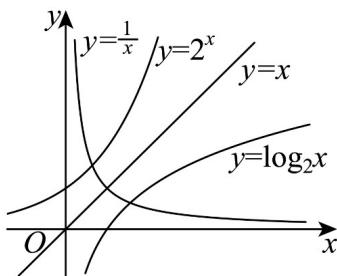

若 $a + b = 2$ 成立，再结合 $ab = 1$ ，可得 $a = b = 1$ ，与 $a \cdot 2^a = 1$ 矛盾，故D错误

故选：D.

## 题型精讲

![[高中/课堂同步/题库/人教A版高中数学同步讲义(2026)/01_必修第一册/第四章 指数函数与对数函数/专题4.4 对数函数（高效培优讲义）/题型01_对数函数定义的判断/题型01_对数函数定义的判断.md]]
![[高中/课堂同步/题库/人教A版高中数学同步讲义(2026)/01_必修第一册/第四章 指数函数与对数函数/专题4.4 对数函数（高效培优讲义）/题型02_利用对数函数的定义求参数/题型02_利用对数函数的定义求参数.md]]
![[高中/课堂同步/题库/人教A版高中数学同步讲义(2026)/01_必修第一册/第四章 指数函数与对数函数/专题4.4 对数函数（高效培优讲义）/题型03_求对数函数的表达式/题型03_求对数函数的表达式.md]]
![[高中/课堂同步/题库/人教A版高中数学同步讲义(2026)/01_必修第一册/第四章 指数函数与对数函数/专题4.4 对数函数（高效培优讲义）/题型04_对数型函数过定点问题/题型04_对数型函数过定点问题.md]]
![[高中/课堂同步/题库/人教A版高中数学同步讲义(2026)/01_必修第一册/第四章 指数函数与对数函数/专题4.4 对数函数（高效培优讲义）/题型05_对数函数的图象问题/题型05_对数函数的图象问题.md]]
![[高中/课堂同步/题库/人教A版高中数学同步讲义(2026)/01_必修第一册/第四章 指数函数与对数函数/专题4.4 对数函数（高效培优讲义）/题型06_对数函数的定义域/题型06_对数函数的定义域.md]]
![[高中/课堂同步/题库/人教A版高中数学同步讲义(2026)/01_必修第一册/第四章 指数函数与对数函数/专题4.4 对数函数（高效培优讲义）/题型07_对数函数的值域与最值/题型07_对数函数的值域与最值.md]]
![[高中/课堂同步/题库/人教A版高中数学同步讲义(2026)/01_必修第一册/第四章 指数函数与对数函数/专题4.4 对数函数（高效培优讲义）/题型08_对数函数的单调性及其应用/题型08_对数函数的单调性及其应用.md]]
![[高中/课堂同步/题库/人教A版高中数学同步讲义(2026)/01_必修第一册/第四章 指数函数与对数函数/专题4.4 对数函数（高效培优讲义）/题型09_比较指数幂的大小/题型09_比较指数幂的大小.md]]
![[高中/课堂同步/题库/人教A版高中数学同步讲义(2026)/01_必修第一册/第四章 指数函数与对数函数/专题4.4 对数函数（高效培优讲义）/题型10_解对数型不等式/题型10_解对数型不等式.md]]
![[高中/课堂同步/题库/人教A版高中数学同步讲义(2026)/01_必修第一册/第四章 指数函数与对数函数/专题4.4 对数函数（高效培优讲义）/题型11_判断对数函数的奇偶性/题型11_判断对数函数的奇偶性.md]]
![[高中/课堂同步/题库/人教A版高中数学同步讲义(2026)/01_必修第一册/第四章 指数函数与对数函数/专题4.4 对数函数（高效培优讲义）/题型12_反函数/题型12_反函数.md]]
![[高中/课堂同步/题库/人教A版高中数学同步讲义(2026)/01_必修第一册/第四章 指数函数与对数函数/专题4.4 对数函数（高效培优讲义）/题型13_对数函数性质的综合应用/题型13_对数函数性质的综合应用.md]]
![[高中/课堂同步/题库/人教A版高中数学同步讲义(2026)/01_必修第一册/第四章 指数函数与对数函数/专题4.4 对数函数（高效培优讲义）/强化训练/强化训练.md]]
