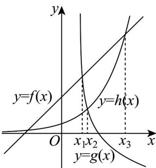

> [!faq]- 《专题4.4 对数函数（高效培优讲义）》官方解析
>
> > [!success]- **【答案】** C
>
> > [!note]- **【解析】**
> > 令 $a - 2 = \left(\frac{1}{2}\right)^b + 1 = \log_2 c + 1 = x$ ，则 $a = x + 2, b = \frac{\log_{\frac{1}{2}}(x - 1), c = 2^{x - 1}(x > 1)}{2}$
> >
> > 函数 $f(x) = x + 2, g(x) = \frac{\log_1 (x - 1), h(x) = 2^{x - 1}}{2}$ 的大致图象如图所示.
> >
> > 
> >
> > 当 $1 < x < x_{1}$ 时， $g(x) > f(x) > h(x)$ ，即 b > a > c；
> >
> > 当 $x_{1} < x < x_{2}$ 时， $f(x) > g(x) > h(x)$ ，即 $a > b > c$ ；
> >
> > 当 $x_{2}<x<x_{3}$ 时， $f(x)>h(x)>g(x)$ ，即 a>c>b；
> >
> > 当 $x > x_{3}$ 时， $h(x) > f(x) > g(x)$ ，即 c > a > b。
> >
> > 故选 **C**.
