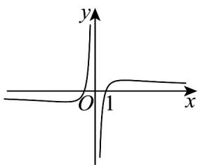
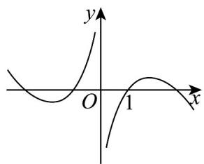
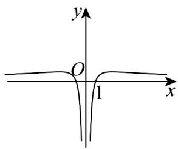
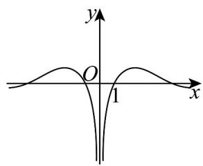

## 强化训练

1. 函数 $f(x)=\frac{\ln x^{2}}{2x}$ 的图象大致是（）

【答案】

A

B

C

D

【答案】A

【详解】函数 $f(x) = \frac{\ln x^2}{2x}$ 的定义域为 $(- \infty, 0) \cup (0, +\infty)$ ， $f(-x) = \frac{\ln (-x)^2}{2(-x)} = -\frac{\ln x^2}{2x} = -f(x)$

函数 $f(x)$ 是奇函数，其图象关于原点对称，排除 CD；

当 x > 1 时， $\frac{\ln x^{2}}{2x} = \frac{\ln x}{x} > 0$ ，排除 B，选项 A 符合要求.

故选：A

![[高中/课堂同步/题库/人教A版高中数学同步讲义(2026)/01_必修第一册/第四章 指数函数与对数函数/专题4.4 对数函数（高效培优讲义）/强化训练/questions/Q00075668.md]]
![[高中/课堂同步/题库/人教A版高中数学同步讲义(2026)/01_必修第一册/第四章 指数函数与对数函数/专题4.4 对数函数（高效培优讲义）/强化训练/questions/Q00075669.md]]
![[高中/课堂同步/题库/人教A版高中数学同步讲义(2026)/01_必修第一册/第四章 指数函数与对数函数/专题4.4 对数函数（高效培优讲义）/强化训练/questions/Q00075670.md]]
![[高中/课堂同步/题库/人教A版高中数学同步讲义(2026)/01_必修第一册/第四章 指数函数与对数函数/专题4.4 对数函数（高效培优讲义）/强化训练/questions/Q00075671.md]]
![[高中/课堂同步/题库/人教A版高中数学同步讲义(2026)/01_必修第一册/第四章 指数函数与对数函数/专题4.4 对数函数（高效培优讲义）/强化训练/questions/Q00075672.md]]
![[高中/课堂同步/题库/人教A版高中数学同步讲义(2026)/01_必修第一册/第四章 指数函数与对数函数/专题4.4 对数函数（高效培优讲义）/强化训练/questions/Q00075673.md]]
![[高中/课堂同步/题库/人教A版高中数学同步讲义(2026)/01_必修第一册/第四章 指数函数与对数函数/专题4.4 对数函数（高效培优讲义）/强化训练/questions/Q00075674.md]]
![[高中/课堂同步/题库/人教A版高中数学同步讲义(2026)/01_必修第一册/第四章 指数函数与对数函数/专题4.4 对数函数（高效培优讲义）/强化训练/questions/Q00075675.md]]
![[高中/课堂同步/题库/人教A版高中数学同步讲义(2026)/01_必修第一册/第四章 指数函数与对数函数/专题4.4 对数函数（高效培优讲义）/强化训练/questions/Q00075676.md]]
![[高中/课堂同步/题库/人教A版高中数学同步讲义(2026)/01_必修第一册/第四章 指数函数与对数函数/专题4.4 对数函数（高效培优讲义）/强化训练/questions/Q00075677.md]]
![[高中/课堂同步/题库/人教A版高中数学同步讲义(2026)/01_必修第一册/第四章 指数函数与对数函数/专题4.4 对数函数（高效培优讲义）/强化训练/questions/Q00075678.md]]
![[高中/课堂同步/题库/人教A版高中数学同步讲义(2026)/01_必修第一册/第四章 指数函数与对数函数/专题4.4 对数函数（高效培优讲义）/强化训练/questions/Q00075679.md]]
![[高中/课堂同步/题库/人教A版高中数学同步讲义(2026)/01_必修第一册/第四章 指数函数与对数函数/专题4.4 对数函数（高效培优讲义）/强化训练/questions/Q00075680.md]]
![[高中/课堂同步/题库/人教A版高中数学同步讲义(2026)/01_必修第一册/第四章 指数函数与对数函数/专题4.4 对数函数（高效培优讲义）/强化训练/questions/Q00075681.md]]
![[高中/课堂同步/题库/人教A版高中数学同步讲义(2026)/01_必修第一册/第四章 指数函数与对数函数/专题4.4 对数函数（高效培优讲义）/强化训练/questions/Q00075682.md]]
![[高中/课堂同步/题库/人教A版高中数学同步讲义(2026)/01_必修第一册/第四章 指数函数与对数函数/专题4.4 对数函数（高效培优讲义）/强化训练/questions/Q00075683.md]]
![[高中/课堂同步/题库/人教A版高中数学同步讲义(2026)/01_必修第一册/第四章 指数函数与对数函数/专题4.4 对数函数（高效培优讲义）/强化训练/questions/Q00075684.md]]
![[高中/课堂同步/题库/人教A版高中数学同步讲义(2026)/01_必修第一册/第四章 指数函数与对数函数/专题4.4 对数函数（高效培优讲义）/强化训练/questions/Q00075685.md]]
