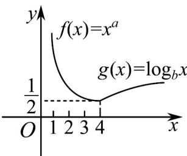

<!-- question-source:start -->
【变式2】函数 $y = F(x)$ 的图象如图所示，该图象由幂函数 $f(x) = x^a$ 与对数函数 $g(x) = \log_b x$ “拼接”而成。

(1)求 $F(x)$ 的解析式；

(2)若 $\left(m + 2\right)^{-a} > \left(3 - 2m\right)^{-a}$ ，求 $m$ 的取值范围。
<!-- question-source:end -->

![[高中/课堂同步/题库/人教A版高中数学同步讲义(2026)/01_必修第一册/第四章 指数函数与对数函数/专题4.4 对数函数（高效培优讲义）/题型03_求对数函数的表达式/questions/answers/Q00075626A1.md]]
