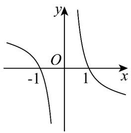
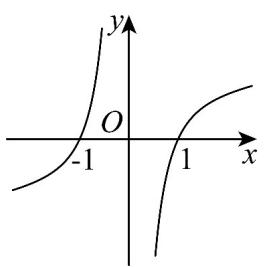
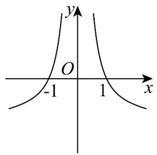
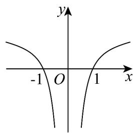

<!-- question-source:start -->
【典例1】函数 $f(x) = \left(1 + \frac{2}{e^x - 1}\right)\ln |x|$ 的部分图象大致为（）

A.

B

C

D

<!-- question-source:end -->

![[高中/课堂同步/题库/人教A版高中数学同步讲义(2026)/01_必修第一册/第四章 指数函数与对数函数/专题4.4 对数函数（高效培优讲义）/题型05_对数函数的图象问题/questions/answers/Q00075632A1.md]]
