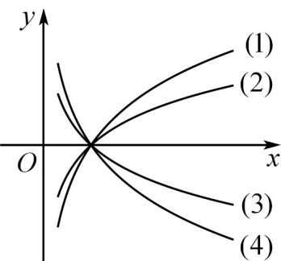

> [!faq]- 《专题4.4 对数函数（高效培优讲义）》官方解析
>
> > [!success]- **【答案】**  A. (1) B. (2) C. (3) D. (4)
>
> > [!note]- **【解析】**
> > 因为 $\log_{\frac{1}{7}}\frac{1}{5} < \log_{\frac{1}{7}}\frac{1}{7} = \log_{\frac{1}{5}}\frac{1}{5}$
> >
> > 即当 $x=\frac{1}{5}$ 时， $\log_{\frac{1}{7}}x<\log_{\frac{1}{5}}x$
> >
> > $\therefore (3) \text{ 是 } y = \log_{\frac{1}{7}} x, (4) \text{ 是 } y = \log_{\frac{1}{5}} x,$
> >
> > 又 $y=\log_{\frac{1}{5}}x=-\log_{5}x$ 与 $y=\log_{5}x$ 关于 x 轴对称，
> >
> > $\therefore$ (1) 是 $y = \log_{5} x$ .
