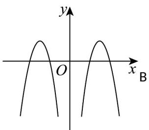
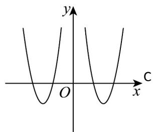
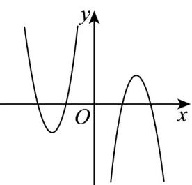
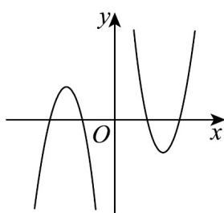

> [!faq]- 《专题4.4 对数函数（高效培优讲义）》官方解析
>
> > [!success]- **【答案】** A    
>
> > [!note]- **【解析】**
> > $f(x)$ 是偶函数， $g(x)$ 是奇函数，则 $y = f(x)g(x)$ 是奇函数，图象关于原点对称，排除AB， $x > 2$ 时， $f(x) < 0$ ， $g(x) > 0$ ，则 $y = f(x)g(x) < 0$ ，排除D，
> >
> > 故选 **C**.
