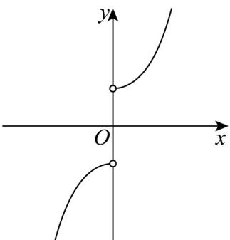

> [!faq]- 《专题4.4 对数函数（高效培优讲义）》官方解析
>
> > [!success]- **【答案】**  A. $f(x) = \frac{\mathrm{e}^x + \mathrm{e}^{-x}}{|x|}$ B. $f(x) = \frac{\mathrm{e}^x - \mathrm{e}^{-x}}{|x|}$ C. $f(x) = \frac{\ln x}{|x|}$ D. $f(x) = \frac{\ln|x|}{x}$
>
> > [!note]- **【解析】**
> > 由题可得函数的图象关于原点对称，定义域为 $\left(-\infty,0\right)\cup \left(0, + \infty\right)$
> >
> > 对于 A， $f(-x)=\frac{e^{-x}+e^{x}}{|-x|}=\frac{e^{x}+e^{-x}}{|x|}=f(x)$ ，函数关于 y 轴对称，故 A 错误；
> >
> > 对于 C，因为 $f(x)=\frac{\ln x}{|x|}$ 的定义域为 $(0,+\infty)$ ，故 C 错误；
> >
> > 对于 $D$ ，当 $0 < x < 1$ ，时， $f(x) < 0$ ，不符合图象，故 $D$ 错误；
> >
> > 对于 B， $f(-x)=\frac{e^{-x}-e^{x}}{|-x|}=\frac{e^{-x}-e^{x}}{|x|}=-f(x)$ ，函数的图象关于原点对称，且 x>0 时， $f(x)>0$ ，符合题意，
> >
> > 所以 B 正确·
> >
> > 故选 **B**.
