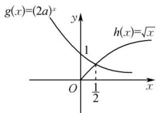

> [!faq]- 《专题4.4 对数函数（高效培优讲义）》官方解析
>
> > [!success]- **【答案】** B
>
> > [!note]- **【解析】**
> > 由题意知对任意 $x \in \left[\frac{1}{2}, +\infty\right)$ ，都有 $\sqrt{x} > (2a)^x$ 恒成立，显然 $0 < 2a < 1$ ，否则，当 $x \in \left[\frac{1}{2}, +\infty\right)$ 时，一
> >
> > 定存在 $x = x_0$ ，使 $\sqrt{x} < (2a)^x$ ．令 $g(x) = (2a)^x, h(x) = \sqrt{x}$ ．由图可知，在 $x = \frac{1}{2}$ 处的函数 $g(x) = (2a)^x$ 的值小于 $h(x) = \sqrt{x}$ 的值时，满足题意，所以 $\sqrt{2a} < \frac{\sqrt{2}}{2}$ ，所以 $a < \frac{1}{4}$ 又 $a > 0$ 且 $a\neq 1$ ，所以 $0 < a < \frac{1}{4}$
> >
> > 
