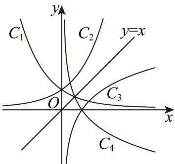

<!-- question-source:start -->
【变式1】如图，曲线 $C_1$ 是函数 $y = a^x (0 < a < 1)$ 的图象，曲线 $C_2$ 与曲线 $C_1$ 关于 $y$ 轴对称，曲线 $C_2$ 与曲线 $C_3$

关于直线 y = x 对称，曲线 $C_{3}$ 与曲线 $C_{4}$ 关于 x 轴对称，则曲线 $C_{2}$ ， $C_{3}$ ， $C_{4}$ 对应的函数解析式分别是（）

A. $y = a^{-x}, y = -\log_a x, y = \log_a x$ B. $y = \log_a x, y = a^{-x}, y = -\log_a x$

C $y = \log_a x, y = -\log_a x, y = a^{-x}$ D $y = -\log_a x, y = a^{-x}, y = \log_a x$
<!-- question-source:end -->

![[高中/课堂同步/题库/人教A版高中数学同步讲义(2026)/01_必修第一册/第四章 指数函数与对数函数/专题4.4 对数函数（高效培优讲义）/题型12_反函数/questions/answers/Q00075661A1.md]]
