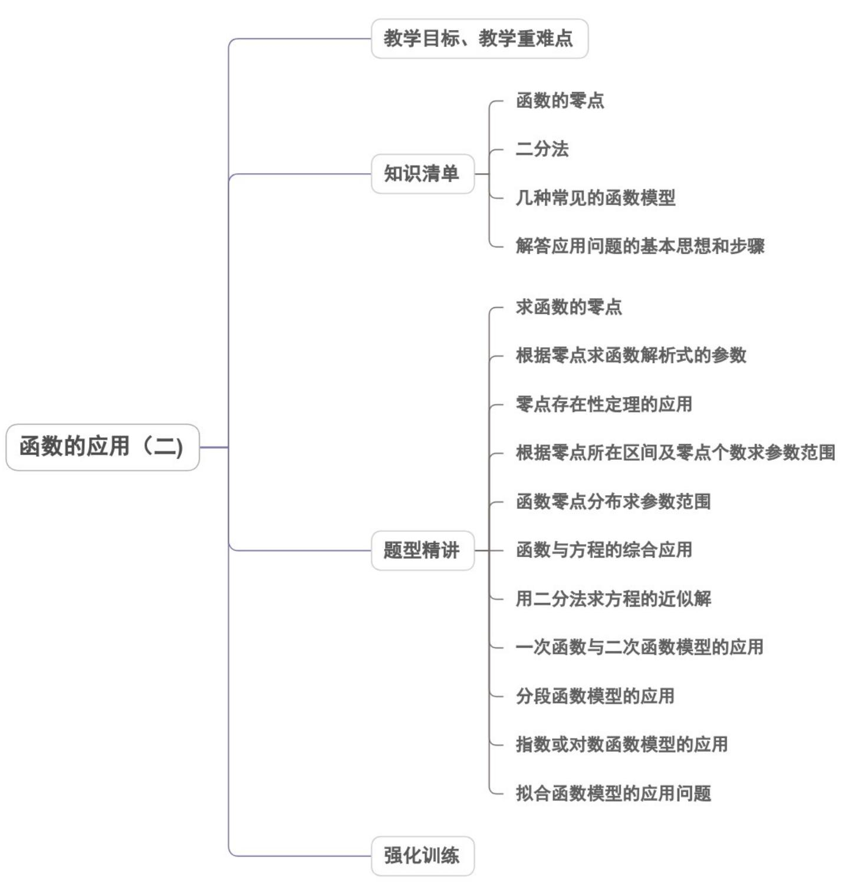
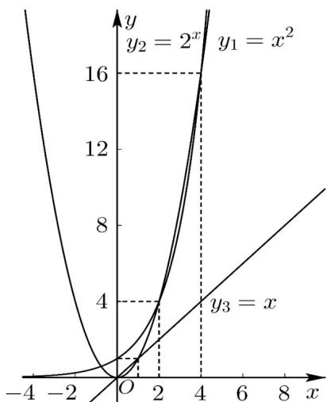
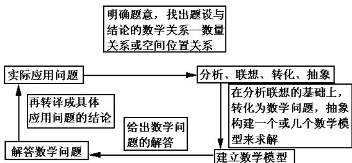

<!-- source-part:1 pages:1-50 -->

专题4.5 函数的应用（二）

## 教学目标、教学重难点

<table><tr><td>教学目标</td><td>1.了解函数的零点与方程的解的关系,并能结合函数的图象判定函数的零点。2.能根据函数零点存在性定理对函数零点存在进行判定,同时能处理与函数零点问题相结合的求参数及综合类的问题。3.理解运用二分法逼近方程近似解的数学思想。4.了解二分法只能用于求变号零点的方法。5.借助数学工具用二分法求方程的近似解。6.能解决与方程近似解有关的问题。7.了解函数模型(如指数函数、对数函数、幂函数、分段函数等在社会生活中普遍使用的函数模型)的广泛应用。8.在实际情境中,会选择合适的函数类型刻画现实问题的变化规律。</td></tr><tr><td>教学重难点</td><td>1.重点:要求能判定函数零点的存在,同时能解决与函数零点相结合的综合问题2.难点:掌握一次函数、二次函数、指数函数、对数函数、幂函数以及其他函数模型;会从实际问题中抽象出函数模型,进而利用函数知识求解.高考对函数应用的考查,常与二次函数、基本不等式等知识交汇.</td></tr></table>

## 知识清单

## 知识点 01 函数的零点

## 1、函数的零点

(1) 一般地，如果函数 $y = f(x)$ 在实数 $\alpha$ 处的值等于零，即 $f(\alpha) = 0$ ，则 $a$ 叫做这个函数的零点.

(2) 二次函数的零点

二次函数 $y = ax^{2} + bx + c$ 的零点个数，方程 $ax^{2} + bx + c = 0$ 的实根个数见下表.

<table><tr><td>判别式</td><td>方程的根</td><td>函数的零点</td></tr><tr><td>Δ&gt;0</td><td>两个不相等的实根</td><td>两个零点</td></tr><tr><td>Δ=0</td><td>两个相等的实根</td><td>一个二重零点</td></tr><tr><td>Δ&lt;0</td><td>无实根</td><td>无零点</td></tr></table>

(3) 二次函数零点的性质

①二次函数的图象是连续的，当它通过零点时（不是二重零点），函数值变号.

②相邻两个零点之间的所有的函数值保持同号.

## 2、函数零点的判定

## (1) 利用函数零点存在性的判定定理

如果函数 $y = f(x)$ 在一个区间 $[a, b]$ 上的图象不间断，并且在它的两个端点处的函数值异号，即 $f(a)f(b) < 0$ ，则这个函数在这个区间上，至少有一个零点，即存在一点 $x_0 \in (a, b)$ ，使 $f(x_0) = 0$ ，这个 $x_0$ 也就是方程 $f(x) = 0$ 的根.

## (2) 利用方程求解法

求函数的零点时，先考虑解方程 $f(x) = 0$ ，方程 $f(x) = 0$ 无实根则函数无零点，方程 $f(x) = 0$ 有实根则函数有

零点.

## (3) 利用数形结合法

函数 $F(x) = f(x) - g(x)$ 的零点就是方程 $f(x) = g(x)$ 的实数根，也就是函数 $y = f(x)$ 的图象与 $y = g(x)$ 的图象

交点的横坐标．

3、零点个数的判断方法

(1) 直接法：直接求零点，令 $f(x)=0$ ，如果能求出解，则有几个不同的解就有几个零点.

(2) 定理法：利用零点存在定理，函数的图象在区间 $[a, b]$ 上是连续不断的曲线，且 $f(a) \cdot f(b) < 0$

结合函数的图象与性质(如单调性、奇偶性)才能确定函数有多少个零点.

(3) 数形结合法：

①单个函数图象：利用图象交点的个数，画出函数 $f(x)$ 的图象，函数 $f(x)$ 的图象与 $x$ 轴交点的个数就是函

数 $f(x)$ 的零点个数；

②两个函数图象：将函数 $f(x)$ 拆成两个函数 $h(x)$ 和 $g(x)$ 的差，根据 $f(x) = 0 \Leftrightarrow h(x) = g(x)$ ，则函数 $f(x)$

的零点个数就是函数 $y = h(x)$ 和 $y = g(x)$ 的图象的交点个数.

4、判断函数零点所在区间

(1) 将区间端点代入函数求函数的值；

(2) 将所得函数值相乘，并进行符号判断；

(3) 若符号为正且在该区间内是递增或递减，则函数在该区间内无零点；若符号为负且函数图象连续，则函

数在该区间内至少一个零点。

5、已知函数零点个数，求参数取值范围的方法

(1) 直接法：利用零点存在的判定定理建立不等式；

(2) 数形结合法：转化为两个函数图象的交点问题，再结合图象求参数的取值范围；

(3) 分离参数法：分离参数后转化为求函数的值域问题。

## 【即学即练】

1. 函数 $f(x) = \ln x + x$ 的零点所在区间为（ ） A. (0,1) B. (1,2) C. (2,3) D. (3,4)

【答案】A

【详解】由函数单调性的性质可知函数 $f(x) = \ln x + x$ 是正实数集上的增函数，因为 $f(1) > 0$ ，当自变量 $x$ 趋近0时，函数值趋近 $-\infty$ ，所以函数 $f(x) = \ln x + x$ 的零点所在区间为 $(0,1)$ ，

故选：A

2. 函数 $f(x) = 8x^{3} + 2x - 17$ 的零点所在区间为（）A. $\left(0, \frac{1}{2}\right)$ B. $\left(\frac{1}{2}, 1\right)$ C. $\left(1, \frac{3}{2}\right)$ D. $\left(\frac{3}{2}, 2\right)$

【答案】C

【详解】已知 $f(x) = 8x^{3} + 2x - 17$ ，因为 $y = x^3, y = x$ 都是 $\mathbb{R}$ 上的增函数，所以函数 $f(x) = 8x^{3} + 2x - 17$ 是连续的增函数，易知 $f(1) = 10 - 17 = -7 < 0$ ， $f\left(\frac{3}{2}\right) = 30 - 17 = 13 > 0$

可知 $f(1)f\left(\frac{3}{2}\right) < 0$ ，故函数 $f(x) = 8x^{3} + 2x - 17$ 的零点所在的区间是 $\left(1,\frac{3}{2}\right)$

故选：C.

## 知识点 02 二分法

## 1、二分法

对于区间 $[a,b]$ 上图象连续不断且 $f(a)\cdot f(b) < 0$ 的函数 $f(x)$ ，通过不断把它的零点所在区间一分为二，使所

得区间的两个端点逐渐逼近零点，进而得到近似值的方法。

2、用二分法求函数零点的一般步骤：

已知函数 $y = f(x)$ 定义在区间 $D$ 上，求它在 $D$ 上的一个零点 $x_0$ 的近似值 $x$ ，使它满足给定的精确度。

第一步：在 $D$ 内取一个闭区间 $\left[a_0, b_0\right] \subseteq D$ ，使 $f(a_0)$ 与 $f(b_0)$ 异号，即 $f(a_0) \cdot f(b_0) < 0$ ，零点位于区间 $\left[a_0, b_0\right]$ 中。

第二步：取区间 $\left[a_0, b_0\right]$ 的中点，则此中点对应的坐标为 $x_0 = a_0 + \frac{1}{2} (b_0 - a_0) = \frac{1}{2} (a_0 + b_0)$

计算 $f(x_0)$ 和 $f(a_0)$ ，并判断：

①如果 $f(x_0) = 0$ ，则 $x_0$ 就是 $f(x)$ 的零点，计算终止；

②如果 $f(a_0) \cdot f(x_0) < 0$ ，则零点位于区间 $[a_0, x_0]$ 中，令 $a_1 = a_0, b_1 = x_0$ ；

③如果 $f(a_0) \cdot f(x_0) > 0$ ，则零点位于区间 $[x_0, b_0]$ 中，令 $a_1 = x_0, b_1 = b_0$

第三步：取区间 $[a_1, b_1]$ 的中点，则此中点对应的坐标为

$$
x _ {1} = a _ {1} + \frac {1}{2} \left(b _ {1} - a _ {1}\right) = \frac {1}{2} \left(a _ {1} + b _ {1}\right)
$$

计算 $f(x_{1})$ 和 $f(a_{1})$ ，并判断：

①如果 $f(x_{1}) = 0$ ，则 $x_{1}$ 就是 $f(x)$ 的零点，计算终止；

②如果 $f(a_{1})\cdot f(x_{1}) < 0$ ，则零点位于区间 $[a_1,x_1]$ 中，令 $a_2 = a_1,b_2 = x_1$

③如果 $f(a_{1})\cdot f(x_{1}) > 0$ ，则零点位于区间 $[x_1,b_1]$ 中，令 $a_2 = x_1,b_2 = b_1$ ；……

继续实施上述步骤，直到区间 $\left[a_{n},b_{n}\right]$ ，函数的零点总位于区间 $\left[a_{n},b_{n}\right]$ 上，当 $a_{n}$ 和 $b_{n}$ 按照给定的精确度所取

的近似值相同时，这个相同的近似值就是函数 $y = f(x)$ 的近似零点，计算终止。这时函数 $y = f(x)$ 的近似零

点满足给定的精确度．

## 3、关于精确度

(1) “精确度”与“精确到”不是一回事，

这里的“精确度”是指区间的长度达到某个确定的数值 $\varepsilon$ ，即 $|a - b| < \varepsilon$ ；“精确到”是指某讴歌数的数位达到某个

规定的数位．

(2) 精确度 $\varepsilon$ 表示当区间的长度小于 $\varepsilon$ 时停止二分；此时除可用区间的端点代替近似值外，还可选用该区间

内的任意一个数值作零点近似值．

【即学即练】

1. 已知函数 $f(x) = 2^x + x - \frac{3}{2}, g(x) = \log_2 x + x - \frac{3}{2}, h(x) = 2x - \frac{3}{2}$ 的零点分别为 $a, b, c$ ，则（）

【答案】

A. $a > b > c$ B. $b > c > a$ C. $c > a > b$ D. $b > a > c$

【答案】B

## 【详解】由复合函数的单调性易知三个函数均连续且在定义域内单调递增·

对于 $f(x) = 2^{x} + x - \frac{3}{2}, f(0) = -\frac{1}{2} < 0, f\left(\frac{1}{2}\right) = \sqrt{2} - 1 > 0$ ，由零点存在定理知 $a \in \left(0, \frac{1}{2}\right)$ . 对于 $g(x) = \log_{2} x + x - \frac{3}{2}, g(1) = -\frac{1}{2}, g(2) = \frac{3}{2}, \therefore b \in (1, 2)$ . 对于 $h(x) = 2x - \frac{3}{2}$ ，可知 $h(x)$ 的零点 $c = \frac{3}{4} \in \left(\frac{1}{2}, 1\right), \therefore b > c > a$ .

故选：B

2. 下列函数中，不能用二分法求其零点近似值的是（ ）A. $f(x) = \ln x + 2$ B. $f(x) = x^2 + 2\sqrt{2}x + 2$ C. $f(x) = x + \frac{1}{x} - 3$ D. $f(x) = 2^x - 3$

【答案】B

【详解】对于 A，函数 $f(x)=\ln x+2$ 在 R 上单调递增，有唯一零点 $x=e^{-2}$

所以函数值在零点两侧异号，故可用二分法求零点；

对于 B，函数 $f(x)=x^{2}+2\sqrt{2}x+2=\left(x+\sqrt{2}\right)^{2}$ 0

故函数有唯一零点 $x = -\sqrt{2}$ ，且函数值在零点两侧同号，故不能用二分法求零点；

对于 $\mathbb{C}$ ，当 $x < 0$ 时， $f(x) = x + \frac{1}{x} - 3 = -\left(-x + \frac{1}{-x}\right) - 3 \leq -2\sqrt{-x \cdot \frac{1}{-x}} - 3 = -5$

当且仅当 $x = -1$ 时，等号成立，无零点；

当 $x > 0$ 时， $f(x) = x + \frac{1}{x} - 3, 2\sqrt{x \cdot \frac{1}{x}} - 3 = -1$ ，当且仅当 $x = 1$ 时，等号成立，

函数在 $(0,1)$ 上单调递减，在 $(1, +\infty)$ 上单调递增，

此时有两个零点 $x = \frac{3 \pm \sqrt{5}}{2}$ ，且函数值在零点两侧异号，故可用二分法求零点；

对于 $\mathbb{D}$ ，函数 $f(x) = 2^{x} - 3$ 在 $\mathbb{R}$ 上单调递增，有唯一零点 $x = \log_23$

所以函数值在零点两侧异号，故可用二分法求零点·

故选：B

## 知识点 03 几种常见的函数模型

1、一次函数模型： $y = kx + b$ （k，b为常数， $k \neq 0$ ）

2、二次函数模型： $y = ax^{2} + bx + c$ （ $a, b, c$ 为常数， $a \neq 0$ ）

3、指数函数模型： $y = ba^{x} + c$ （ $a, b, c$ 为常数， $b \neq 0$ ， $a > 0$ 且 $a \neq 1$ ）

4、对数函数模型： $y = m \log_{a} x + n$ （ $m, a, n$ 为常数， $m \neq 0$ ， $a > 0$ 且 $a \neq 1$ ）

5、幂函数模型： $y = ax^{n} + b$ （a, b 为常数， $a \neq 0$ ）

6、分段函数模型： $y=\left\{\begin{aligned}ax+b,x<m\\ cx+d,x&m\end{aligned}\right.$

【即学即练】

1．已知函数 $y_{1} = x^{2}$ ， $y_{2} = 2^{x}$ ， $y_{3} = x$ ，则下列关于这三个函数的描述中，正确的是（）

【答案】

A. 在 $[4, +\infty)$ 上，随着 $x$ 的逐渐增大， $y_1$ 增长速度越来越快于 $y_2$ B. 在 $[4, +\infty)$ 上，随着 $x$ 的逐渐增大， $y_2$ 增长速度越来越快于 $y_1$ C. 当 $x \in (0, +\infty)$ 时， $y_1$ 的增长速度一直快于 $y_3$ D. 当 $x \in (2, +\infty)$ 时， $y_2 > y_1$

【答案】B

【详解】在同一平面直角坐标系中画出函数 $y_{1} = x^{2}$ ， $y_{2} = 2^{x}$ ， $y_{3} = x$ 的图像，

如图所示，在 $[4, +\infty)$ 上，随着 $x$ 的逐渐增大， $y_2$ 的增长速度越来越快，且快于 $y_1$ ，故A错误；B正确；

对于 $C$ ，当 $x \in (0, +\infty)$ 时， $y_1$ 的增长速度不是一直快于 $y_3$ ，故 $C$ 错误；

对于 D，当 $x \in (2,4)$ 时， $y_{2} < y_{1}$ ，故 D 错误.

故选：B.

2. 某文具店购进一批新型台灯，若按每盏台灯 $^{15}$ 元的价格销售，每天能卖出 $^{30}$ 盏；若售价每提高 $^{1}$ 元，日

销售量将减少 $^{2}$ 盏，现决定提价销售，为了使这批台灯每天获得不少于 $^{400}$ 元的销售收入．则这批台灯的销售单价 $x$ （单位：元）的取值范围是（ ）A. $\{x\mid 10\leq x <   16\}$ B. $\{x\mid 12\leq x <   18\}$ C. $\{x\mid 15\leq x\leq 20\}$ D. $\{x\mid 10\leq x\leq 20\}$

【答案】C

【详解】解：设这批灯的销售单价为 x 元，由题意可得 x 15，

由题意可得 $\left[30 - 2(x - 15)\right]x$ 400

即 $x^{2} - 30x + 200\leq 0$ ，解得 $10\leq x\leq 20$

可得 $x$ 的范围为 $\{x\mid 15\leq x\leq 20\}$

故选：C.

知识点 04 解答应用问题的基本思想和步骤

1、解应用题的基本思想

2、解答函数应用题的基本步骤

求解函数应用题时一般按以下几步进行：

第一步：审题

弄清题意，分清条件和结论，理顺数量关系，初步选择模型。

第二步：建模

在细心阅读与深入理解题意的基础上，引进数学符号，将问题的非数学语言合理转化为数学语言，然后根据

题意，列出数量关系，建立函数模型。这时，要注意函数的定义域应符合实际问题的要求。

第三步：求模

运用数学方法及函数知识进行推理、运算，求解数学模型，得出结果。

第四步：还原

把数学结果转译成实际问题作出解答，对于解出的结果要代入原问题中进行检验、评判，使其符合实际背景。

上述四步可概括为以下流程：

实际问题（文字语言） $\Rightarrow$ 数学问题（数量关系与函数模型） $\Rightarrow$ 建模（数学语言） $\Rightarrow$ 求模（求解数学问题）

反馈（还原成实际问题的解答）.

【即学即练】

1. 当产品产量不大时，成本 $C$ 由固定成本和单位产量的可变成本决定，这二者都是常数，因此 $C$ 是产量 $q$ 的

一次函数；而当产品产量较大时，决定成本的因素比较复杂，成本 $C$ 不再是产量 $q$ 的一次函数．现有某产品

成本 $C$ 是产量 $q$ 的分段函数： $C = f(q) = \begin{cases} 10000 + 8q, & 0 \leq q \leq 4000 \\ 15q - 0.00125q^2, & 4000 < q \leq 6000 \end{cases}$ 下列说法不正确的是（）

A. $q = 4000$ 时， $f(q) = 42000$ B. $q = 6000$ 时，函数 $C = f(q)$ 取得最大值

C．函数 $C = f(q)$ 的值域是 $[10000, 45000]$ D．函数 $C = f(q)$ 在 $[0, 6000]$ 上是增函数

【答案】D

【详解】对于 A，当 $q = 4000$ 时， $f(q) = 10000 + 8 \times 4000 = 42000$ ，A 正确；

对于 B，当 $4000 < q \leq 6000$ 时， $f(q) = -0.00125(q - 6000)^{2} + 45000 \leq 45000$

当且仅当 $q = 6000$ 时取等号，而当 $0 \leq q \leq 4000$ 时， $f(q) \leq f(4000) = 42000$

又 $42000 < 45000$ ，因此当 $q = 6000$ 时，函数 $C = f(q)$ 取得最大值，B正确；

对于 C，函数 $C = f(q)$ 在 $[0, 4000]$ 上递增， $10000 \leq f(q) \leq 42000$

在 $(4000,6000]$ 上递增， $40000 < f(q) \leq 45000$ ，因此函数 $C = f(q)$ 的值域是 $[10000,45000]$ ，C 正确；

对于 D， $f(3975)=41800=f(4400)$ ，因此函数 $C=f(q)$ 在 $[0,6000]$ 上不单调，D 错误.

故选：D

2. Deepseek（深度求索）是人工智能的一种具有代表性的实现方法，它是以神经网络为出发点·在神经网络

优化中，指数衰减的学习率模型为 $L = L_0D^{\frac{G}{G_0}}$ ，其中 $L$ 表示每一轮优化时使用的学习率， $L_0$ 表示初始学习率，

$D$ 表示衰减系数， $G$ 表示训练迭代轮数， $G_{0}$ 表示衰减速度．已知某个指数衰减的学习率模型的初始学习率为

0.6，衰减速度为 $20$ ，且当训练迭代轮数为 $10$ 时，学习率衰减为0.3，则学习率衰减到0.2以下（不含0.2）所

需的训练迭代轮数至少为（）

(参考数据： $\lg2\approx0.3$ ， $\lg3\approx0.477$ )

【答案】C

【详解】由于 $L = L_{0}D^{\frac{G}{G_{0}}}$ ，所以 $L = 0.6 \times D^{\frac{G}{20}}$ ，

依题意 $0.3 = 0.6 \times D^{\frac{1}{2}}$ ，则 $D = \frac{1}{4}$

则 $L = 0.6 \times \left(\frac{1}{4}\right)^{\frac{G}{20}}$ ，由 $L = 0.6 \times \left(\frac{1}{4}\right)^{\frac{G}{20}} < 0.2$

所以，即 $G > 20\log_{\frac{1}{4}}\frac{1}{3} = 10\log_23 = 10\frac{\lg 3}{\lg 2}\approx 10\cdot \frac{0.477}{0.3} = 15.9$

所以所需的训练迭代轮数至少为 16 次.

故选：C.

## 题型精讲

![[高中/课堂同步/题库/人教A版高中数学同步讲义(2026)/01_必修第一册/第四章 指数函数与对数函数/专题4.5 函数的应用（二）（高效培优讲义）/题型01_求函数的零点/题型01_求函数的零点.md]]
![[高中/课堂同步/题库/人教A版高中数学同步讲义(2026)/01_必修第一册/第四章 指数函数与对数函数/专题4.5 函数的应用（二）（高效培优讲义）/题型02_零点存在性定理的应用/题型02_零点存在性定理的应用.md]]
![[高中/课堂同步/题库/人教A版高中数学同步讲义(2026)/01_必修第一册/第四章 指数函数与对数函数/专题4.5 函数的应用（二）（高效培优讲义）/题型03_根据零点所在区间及零点个数求参数范围/题型03_根据零点所在区间及零点个数求参数范围.md]]
![[高中/课堂同步/题库/人教A版高中数学同步讲义(2026)/01_必修第一册/第四章 指数函数与对数函数/专题4.5 函数的应用（二）（高效培优讲义）/题型04_函数零点分布求参数范围/题型04_函数零点分布求参数范围.md]]
![[高中/课堂同步/题库/人教A版高中数学同步讲义(2026)/01_必修第一册/第四章 指数函数与对数函数/专题4.5 函数的应用（二）（高效培优讲义）/题型05_函数与方程的综合应用/题型05_函数与方程的综合应用.md]]
![[高中/课堂同步/题库/人教A版高中数学同步讲义(2026)/01_必修第一册/第四章 指数函数与对数函数/专题4.5 函数的应用（二）（高效培优讲义）/题型06_用二分法求方程的近似解/题型06_用二分法求方程的近似解.md]]
![[高中/课堂同步/题库/人教A版高中数学同步讲义(2026)/01_必修第一册/第四章 指数函数与对数函数/专题4.5 函数的应用（二）（高效培优讲义）/题型07_一次函数与二次函数模型的应用/题型07_一次函数与二次函数模型的应用.md]]
![[高中/课堂同步/题库/人教A版高中数学同步讲义(2026)/01_必修第一册/第四章 指数函数与对数函数/专题4.5 函数的应用（二）（高效培优讲义）/题型08_分段函数模型的应用/题型08_分段函数模型的应用.md]]
![[高中/课堂同步/题库/人教A版高中数学同步讲义(2026)/01_必修第一册/第四章 指数函数与对数函数/专题4.5 函数的应用（二）（高效培优讲义）/题型9_指数或对数函数模型的应用/题型9_指数或对数函数模型的应用.md]]
![[高中/课堂同步/题库/人教A版高中数学同步讲义(2026)/01_必修第一册/第四章 指数函数与对数函数/专题4.5 函数的应用（二）（高效培优讲义）/题型10_拟合函数模型的应用问题/题型10_拟合函数模型的应用问题.md]]
![[高中/课堂同步/题库/人教A版高中数学同步讲义(2026)/01_必修第一册/第四章 指数函数与对数函数/专题4.5 函数的应用（二）（高效培优讲义）/强化训练/强化训练.md]]
