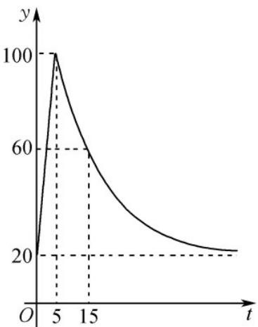

<!-- question-source:start -->
10．某种热饮需用开水冲泡，其基本操作流程如下：①先将水加热到 $100^{\circ}C$ ，水温 $y(^{\circ}C)$ 与时间 $t(\min)$ 近似满足一次函数关系；②用开水将热饮冲泡后在室温下放置，温度 $y(^{\circ}C)$ 与时间 $t(\min)$ 近似满足的函数关系式为 $y = 80\left(\frac{1}{2}\right)^{\frac{t-a}{10}} + b$ （a, b 为常数）·通常这种热饮在 $_{40^{\circ}C}$ 时，口感最佳·某天室温为 $_{20^{\circ}C}$ 时，冲泡热饮的部分数
据如图所示，那么按上述流程冲泡一杯热饮，并在口感最佳时饮用，最少需要的时间为（）

A. $25\mathrm{min}$ B. $30\mathrm{min}$ C. $35\mathrm{min}$ D. $40\mathrm{min}$
<!-- question-source:end -->

![[高中/课堂同步/题库/人教A版高中数学同步讲义(2026)/01_必修第一册/第四章 指数函数与对数函数/专题4.5 函数的应用（二）（高效培优讲义）/强化训练/questions/answers/Q00075732A1.md]]
