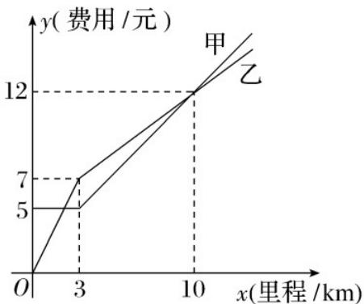

<!-- question-source:start -->
12.（多选）某打车平台欲对收费标准进行改革，现推出了甲、乙两种方案供乘客选择，其支付费用与打车

里程数的函数关系大致如图所示，则下列说法正确的是（）

A. 当打车距离为 $8km$ 时，乘客选择甲方案省钱
B. 当打车距离为 $10km$ 时，乘客选择甲、乙方案均可
C. 打车 $3km$ 以上时，甲方案每千米增加的费用比乙方案多

D．打车3km内（含3km）时，选甲方案需付费5元，行程大于3km时，每增加1km费用增加0.7元
<!-- question-source:end -->

![[高中/课堂同步/题库/人教A版高中数学同步讲义(2026)/01_必修第一册/第四章 指数函数与对数函数/专题4.5 函数的应用（二）（高效培优讲义）/强化训练/questions/answers/Q00075734A1.md]]
