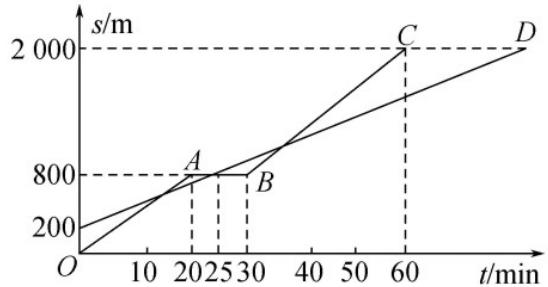

<!-- question-source:start -->
20．小明和爸爸从家步行去公园，爸爸先出发一直匀速前行，小明后出发匀速前行，且途中休息一段时间后

继续以原速前行．家到公园的距离为2000m，如图是小明和爸爸所走的路程 $s(\mathrm{m})$ 与步行时间 $t(\min)$ 的函数

图象.

(1)写出 BC 段图象所对应的函数解析式（不用写出 t 的取值范围）.

(2)小明出发多长时间与爸爸第三次相遇？

(3)在速度都不变的情况下，小明希望比爸爸早 $^{18}$ 分钟到达公园，则小明在步行过程中停留的时间需减少多

少分钟？
<!-- question-source:end -->

![[高中/课堂同步/题库/人教A版高中数学同步讲义(2026)/01_必修第一册/第四章 指数函数与对数函数/专题4.5 函数的应用（二）（高效培优讲义）/强化训练/questions/answers/Q00075740A1.md]]
