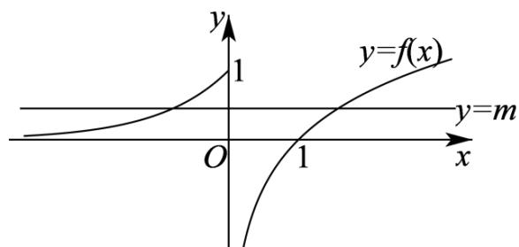

> [!faq]- 《专题4.5 函数的应用（二）（高效培优讲义）》官方解析
>
> > [!success]- **【答案】** A. $f(f(1)) = 0$ B. $f(x)$ 的值域为 $[0, +\infty)$ C. $f(x)$ 在 $\mathbf{R}$ 上单调递增 D. 若关于 $x$ 的方程 $f(x) = m$ 有两个不相等的实数根，则 $m$ 的取值范围为 $(0,1]$
>
> > [!note]- **【解析】**
> > 对于A选项， $f(1) = \ln 1 = 0$ ，故 $f(f(1)) = f(0) = \mathrm{e}^0 = 1$ ，A错；
> > 对于B选项，当 $x > 0$ 时， $f(x) = \ln x\in \mathbf{R}$ ；当 $x\leq 0$ 时， $f(x) = \mathrm{e}^{x}\in (0,1]$ 因此，函数 $f(x)$ 的值域为 $\mathbf{R}$ ，B错；
> > 对于C选项，因为 $f(0) = 1$ ， $f(1) = \ln 1 = 0$ ，则 $f(0) > f(1)$ 故函数 $f(x)$ 在 $\mathbf{R}$ 不是增函数，C错；
> >
> > 对于 $D$ 选项，如下图所示：
> >
> > 
> >
> > 当 $0 < m \leq 1$ 时，直线 $y = m$ 与函数 $f(x)$ 的图象有两个交点，
> >
> > 此时关于 x 的方程 $f(x)=m$ 有两个不相等的实数根，
> >
> > 故实数 m 的取值范围是 $(0,1]$ ，D 对.
> >
> > 故选 **D**.
