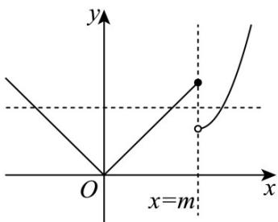

> [!faq]- 《专题4.5 函数的应用（二）（高效培优讲义）》官方解析
>
> > [!success]- **【答案】** B
>
> > [!note]- **【解析】**
> > 由题，因为 $y = x^{2} - 2mx + 4m$ ， $x > m$ 对称轴为 $x = m$
> >
> > 故 $y = x^{2} - 2mx + 4m$ ， $x > m$ 在定义域内为增函数，
> >
> > 由图像可知，若存在实数 $b$ ，使得关于 $x$ 的方程 $f(x) = b$ 有三个不同的根，
> >
> > 则当 x=m 时， $y=\left|x\right|$ 的值大于 $y=x^{2}-2mx+4m$ 的值，
> >
> > 因为 m > 0 ，所以 $m > m^{2} - 2m^{2} + 4m$ ，解得 m > 3 ，故 B 正确·
> >
> > 
> >
> > 故选 **B**.
