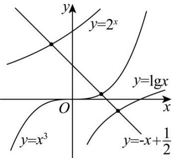

> [!faq]- 《专题4.5 函数的应用（二）（高效培优讲义）》官方解析
>
> > [!success]- **【答案】** ( ) A. $a > b > c$ B. $b > c > a$ C. $c > a > b$ D. $b > a > c$
>
> > [!note]- **【解析】**
> > 在同一平面直角坐标系中分别作出函数 $y = 2^{x}, y = \lg x, y = x^{3}$ 及 $y = -x + \frac{1}{2}$ 的图象，如图所示.
> >
> > 
> >
> > 由图象可知 $b > c > a$ ，故 $\mathbf{B}$ 正确·
> >
> > 故选:B.
> >
> > 6. 抗生素主要有抑菌与杀菌的作用，但抗生素的大量使用容易导致其通过直接或间接的途径进入环境，进而
> >
> > 造成环境污染、危害生物体健康．已知水中某生物体内抗生素的残留量 $^{y}$ （单位：mg）与时间 $^{t}$ （单位：
> >
> > 年）近似满足关系式 $y = \lambda \left(1 - \mathrm{e}^{-\lambda t}\right), \lambda \neq 0$ ，其中 $\lambda$ 为抗生素的残留系数，当 $t = 10$ 时， $y = \frac{3}{4}\lambda$ ，则 $\lambda$ 的值约为
> >
> > ( ) (参考值： $\ln2\approx0.7$ )
> >
> > A 0.54 B 0.34 C 0.24 D 0.14
> >
> > 【答案】D
> >
> > 【详解】由题可知： $y=\lambda\left(1-\mathrm{e}^{-\lambda t}\right)$ ，将 $t=10$ ， $y=\frac{3}{4}\lambda$ 代入上式，
> >
> > 所以 $\frac{3}{4}\lambda = \lambda \left(1 - \mathrm{e}^{-10\lambda}\right) \Rightarrow \mathrm{e}^{-10\lambda} = \frac{1}{4} \Rightarrow \mathrm{e}^{10\lambda} = 2^2 \Rightarrow \lambda = \frac{\ln 2}{5} \approx 0.14$
> >
> > 故选 **D**
