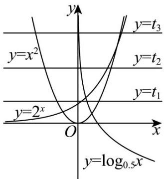

> [!faq]- 《专题4.5 函数的应用（二）（高效培优讲义）》官方解析
>
> > [!success]- **【答案】** ACD
>
> > [!note]- **【解析】**
> > 由题意令 $2^{x} = \log_{\frac{1}{2}}y = z^{2} = t$ ，分别作 $y = 2^{x}$ ， $y = \log_{\frac{1}{2}}x$ ， $y = x^2$ 的图象，如图，当 $y = t_{1}$ 时，可得 $x < y < z$ ，故D正确；
> >
> > 当 $y = t_{2}$ 时，可得 y < x < z ，故 C 正确；
> >
> > 当 $y = t_{3}$ 时，可得 $y < z < x$ ，故 $A$ 正确；
> >
> > 因为 x, y, z 都为正数，所以结合图形不存在 x < z < y 这种情况，故 B 错误；
> >
> > 故选：ACD.
> >
> > 
