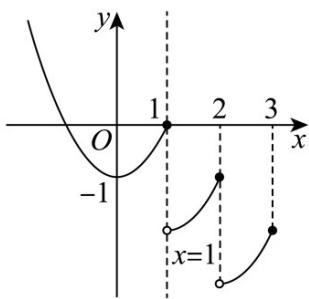

> [!faq]- 《专题4.5 函数的应用（二）（高效培优讲义）》官方解析
>
> > [!success]- **【答案】** ACD
>
> > [!note]- **【解析】**
> > 对于 A：当 n=1 时， $f(2)=f(2-1)-1=f(1)-1=-1$ ， $\therefore f(f(2))=f(-1)=(-1)^{2}-1=0$ ，故 A 选项正
> >
> > 确；
> >
> > 对于 B：当 n=1 作出 $f(x)$ 的图像，由图像知 $f(x)$ 只有 2 个零点，故 B 选项错误；
> >
> > 
> >
> > 对于 C：易知满足 $f(x)=x$ 的解一定是 $f(f(x))=x$ 的解，
> >
> > 而当 $x < 0$ 时， $f(x) = x \Rightarrow x^2 - 1 = x$ ，而方程 $x^2 - x - 1 = 0$ 一定有负根 $\frac{1 - \sqrt{5}}{2}$ ，故 C 选项正确；
> >
> > 对于 D：令 $g(x)=x^{2}-1$ ，当 $x \leq n$ 时， $f(x)$ 有 2 个零点 $\pm1$ ；
> >
> > 当 $x > n$ 时， $f(x)$ 在 $x \in (k - 1, k] (k \in \mathbb{N}$ 且 $k > n)$ 的图像向右平移一个单位，再向下平移一个单位，
> >
> > 即可得到 $f(x)$ 在 $x \in (k, k + 1]$ 的图像， $f(x)$ 的零点问题等价于区间 $\left(f(n - 1), f(n)\right]$ 有几个整数问题，
> >
> > 零点有 $f(n)-f(n-1)=n^{2}-(n-1)^{2}=2n-1$ 个；
> >
> > 一共有零点 $2 + 2n - 1 = 2n + 1$ 个，故 D 选项正确.
> >
> > 故选 **ACD**
