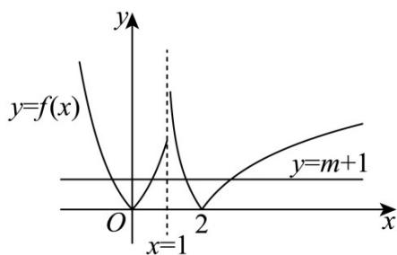

> [!faq]- 《专题4.5 函数的应用（二）（高效培优讲义）》官方解析
>
> > [!success]- **【答案】** $-1 < m \leq 1$
>
> > [!note]- **【解析】**
> > 令 $g(x)=f(x)-m-1=0,\quad f(x)=m+1$
> >
> > 所以 $g(x) = f(x) - m - 1$ 有4个零点等价于函数 $y = f(x)$ 与 $y = m + 1$ 图象有4个交点，
> >
> > 作出图象：
> >
> > 
> >
> > 当 $x = 1$ 时， $f(1) = 2$ ，所以由图可知 $0 < m + 1 \leq 2 \Rightarrow -1 < m \leq 1$ .
> >
> > 故答案为： $-1 < m \leq 1$
