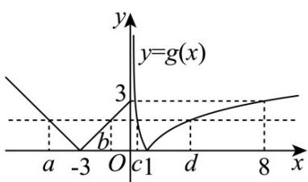

> [!faq]- 《专题4.5 函数的应用（二）（高效培优讲义）》官方解析
>
> > [!success]- **【答案】** $\left[\frac{\sqrt{65}}{8},\sqrt{2}\right)$
>
> > [!note]- **【解析】**
> > 令函数 $g(x) = \begin{cases} -x - 3, & x < -3 \\ x + 3, & -3 \leq x \leq 0 \\ |\log_2 x|, & x > 0 \end{cases} = \begin{cases} |x + 3|, & x \leq 0 \\ |\log_2 x|, & x > 0 \end{cases}$ ，函数 $g(x)$ 的图象，如图所示，
> >
> > 
> >
> > 由题意知， $f(x)$ 的零点为 $g(x)$ 的图象与 y=m 的交点横坐标，且 a<b<c<d
> >
> > 令 $\log_2 x = 3$ ，解得 $x = 8$ ，结合函数图象，可得 $d \in (1,8]$ ，所以 $d^2 \in (1,64]$
> >
> > 因为 $\frac{d^2 + 1}{d^2} = 1 + \frac{1}{d^2}\in \left[\frac{65}{64},2\right)$ ，所以 $\frac{\sqrt{d^2 + 1}}{d}\in \left[\frac{\sqrt{65}}{8},\sqrt{2}\right)$
> >
> > 所以 $\frac{\sqrt{d^{2}+1}}{d}$ 的取值范围为 $\left[\frac{\sqrt{65}}{8},\sqrt{2}\right)$ .
> >
> > 故答案为： $\left[\frac{\sqrt{65}}{8},\sqrt{2}\right)$ .
> >
> > 16. 随着新能源技术的发展，新能源汽车行业也迎来了巨大的商机。某新能源汽车加工厂生产某款新能源汽
> >
> > 车每年需要固定投人 $100$ 万元，此外每生产 $x$ 辆该汽车另需增加投资 $g(x)$ 万元，当该款汽车年产量低于 $400$
> >
> > 辆时， $g(x)=\frac{1}{80}x^{2}+\frac{9}{2}x$ ，当年产量不低于400辆时， $g(x)=16x+\frac{360000}{x}-3500$ ，若该款汽车售价为每辆15
> >
> > 万元，且生产的汽车均能售完，则该工厂生产并销售这款新能源汽车的最高年利润为\_\_\_\_万元。
> >
> > 【答案】2200
> >
> > 【详解】设该工厂生产并销售这款新能源汽车的年利润为 $f(x)$ （万元），
> >
> > 由题意可得 $f(x)=\left\{\begin{aligned}&15x-\left(\frac{1}{80}x^{2}+\frac{9}{2}x\right)-100,0\leq x<400\\&15x-\left(16x+\frac{360000}{x}-3500\right)-100,x\quad400\end{aligned}\right.$
> >
> > 即 $f(x) = \left\{ \begin{array}{ll} - \frac{1}{80} x^2 +\frac{21}{2} x - 100,0\leq x <   400\\ -x - \frac{360000}{x} +3400,x & 400 \end{array} \right.$
> >
> > 当 $0 \leq x < 400$ 时，函数 $f(x)$ 的对称轴为 $x = 420 > 400$ ，则 $f(x) < f(400) = 2100$
> >
> > 当 $x \geq 400$ 时， $f(x) = -\left(x + \frac{360000}{x}\right) + 3400 \leq -2\sqrt{360000} + 3400 = 2200$
> >
> > 当且仅当 x = 600 时， $f(x)$ 取得最大值 2200，
> >
> > 综上可得，该工厂生产并销售这款新能源汽车的最高年利润为2200万元。
> >
> > 故答案为：2200。
