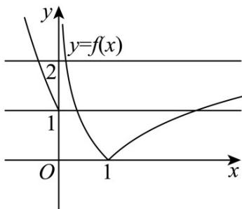

> [!faq]- 《专题4.5 函数的应用（二）（高效培优讲义）》官方解析
>
> > [!success]- **【答案】** C
>
> > [!note]- **【解析】**
> > 方程的 $f^2(x) - 3f(x) + 2 = 0$ 解为 $f(x) = 1$ 或 $f(x) = 2$ ，作出 $y = f(x)$ 的图象，由图象可知零点的个数为6.
> >
> > 
> >
> > 故选 **C**.
