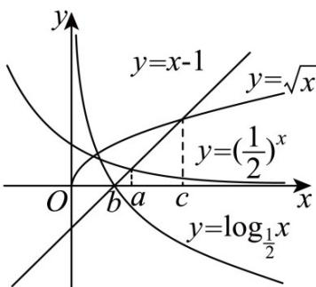

> [!faq]- 《专题4.5 函数的应用（二）（高效培优讲义）》官方解析
>
> > [!success]- **【答案】** B
>
> > [!note]- **【解析】**
> > 函数 $f(x) = \left(\frac{1}{2}\right)^x - x + 1$ ， $g(x) = \log_{\frac{1}{2}} x - x + 1$ ， $h(x) = \sqrt{x} - x + 1$ 的零点，
> >
> > 即为函数 $y = x - 1$ 的图象
> >
> > 分别与函数 $y=\left(\frac{1}{2}\right)^{x}$ ， $y=\log_{\frac{1}{2}}x$ ， $y=\sqrt{x}$ 的图象交点的横坐标，
> >
> > 如图所示：
> >
> > 
> >
> > 由图象可得 $c > a > b$
> >
> > 故选 **B**.
