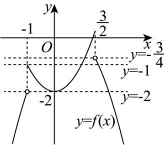

> [!faq]- 《专题4.5 函数的应用（二）（高效培优讲义）》官方解析
>
> > [!success]- **【答案】** B
>
> > [!note]- **【解析】**
> > 令 $\left(x^{2} - 2\right) - \left(x - x^{2}\right)\leq 1$ ，解得 $-1\leq x\leq \frac{3}{2}$
> >
> > $$
> > \therefore f (x) = \left\{ \begin{array}{l l} x ^ {2} - 2, & - 1 \leq x \leq \frac {3}{2} \\ x - x ^ {2}, & x \langle - 1 \text {或} x \rangle \frac {3}{2} \end{array} \right.
> > $$
> >
> > 作出函数 $y = f(x)$ 的图象如图所示:
> >
> > 
> >
> > 函数 $y = f(x) - c$ 的图象与 x 轴恰有两个公共点，即函数 $y = f(x)$ 与 y = c 的图象有 2 个交点，
> > 由函数图象可得 $c \leq -2$ 或 $-1 < c < -\frac{3}{4}$ ;
> >
> > 故选 **B**.
