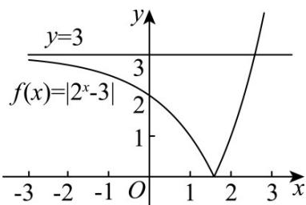

> [!faq]- 《专题4.5 函数的应用（二）（高效培优讲义）》官方解析
>
> > [!success]- **【答案】** D
>
> > [!note]- **【解析】**
> > 令 $t = f(x) = \left|2^{x} - 3\right|$ ，则令 $s(t) = t^{2} - 2mt + 3$ ，即 $s(t) = 0$ 有 4 个不同的实数根
> >
> > 则 $s(t)$ 要有两个解 $t_{1}, t_{2}$ ，
> >
> > 
> >
> > 由图知， $t_{1} \neq t_{2}, 0 < t_{1} < 3, 0 < t_{2} < 3$ .
> >
> > $\Delta = (2m)^{2} - 4 \times 3 > 0$ ，得 $m < -\sqrt{3}$ 或 $m > \sqrt{3}$ .
> >
> > 则 $t=\frac{2m\pm2\sqrt{m^{2}-3}}{2}=m\pm\sqrt{m^{2}-3}$
> >
> > 令 $t_1 = m - \sqrt{m^2 - 3}, 0 < m - \sqrt{m^2 - 3} < 3$ ，得 $m > \sqrt{m^2 - 3}$ ，则 $m > \sqrt{3}$ ， $t_2 = m + \sqrt{m^2 - 3}, 0 < m + \sqrt{m^2 - 3} < 3$ ，得
> >
> > $$
> > 3 - m > \sqrt {m ^ {2} - 3} \quad m <   2
> > $$
> >
> > 则 $\sqrt{3} < m < 2$ .
> >
> > 故选 **D**.
