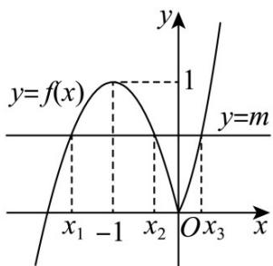

> [!faq]- 《专题4.5 函数的应用（二）（高效培优讲义）》官方解析
>
> > [!success]- **【答案】** D
>
> > [!note]- **【解析】**
> > 依题意，当 $x = 0$ 时， $2x_{3}^{2} + x_{3} = m$ ，当 $x < 0$ 时， $x_{1}, x_{2}$ 为方程 $-x^{2} - 2x = m$
> >
> > 即 $x^{2} + 2x + m = 0$ 的两个根，则 $x_{1} + x_{2} = -2, x_{1}x_{2} = m$
> >
> > 又当 $x < 0$ 时， $f(x) = -x^2 - 2x = -(x + 1)^2 + 1 \leq 1$ ，当且仅当 $x = -1$ 时取等号，
> >
> > 作出函数 $y = f(x)$ 的图象，观察图象知，当且仅当 $0 < m < 1$ 时，方程 $f(x) = m$ 恰有3个不同的实根，
> >
> > 
> >
> > 由 $0 < 2x_{3}^{2} + x_{3} < 1$ ，得 $0 < x_{3} < \frac{1}{2}$ ， $x_{1}x_{2} + x_{1}x_{3} + x_{2}x_{3} = x_{1}x_{2} + x_{3}(x_{1} + x_{2}) = m - 2x_{3}$
> >
> > $= 2x_{3}^{2} - x_{3} = 2(x_{3} - \frac{1}{4})^{2} - \frac{1}{8}$ ，而当 $x_{3} = 0$ 或 $x_{3} = \frac{1}{2}$ 时， $x_{1}x_{2} + x_{1}x_{3} + x_{2}x_{3} = 0$
> >
> > 因此 $-\frac{1}{8} \leq x_1 x_2 + x_1 x_3 + x_2 x_3 < 0$ ，所以 $x_1 x_2 + x_1 x_3 + x_2 x_3$ 的取值范围是 $[- \frac{1}{8}, 0)$ .
> >
> > 故选 **D**
