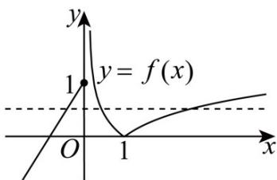
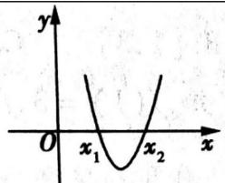
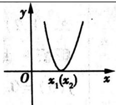
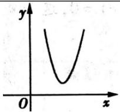

> [!faq]- 《专题4.5 函数的应用（二）（高效培优讲义）》官方解析
>
> > [!success]- **【答案】** B
>
> > [!note]- **【解析】**
> > 因为 $f(x) = \left\{ \begin{array}{ll}\left|\lg x\right|, & x > 0\\ x + 1, & x\leq 0 \end{array} \right.$
> >
> > 所以当 x > 0 时 $f(x) = \left|\lg x\right| = \begin{cases} \lg x, & x = 1 \\ -\lg x, & 0 < x < 1 \end{cases}$
> >
> > 则 $f(x)$ 在 $[1, +\infty)$ 上单调递增，在 $(0, 1)$ 上单调递减，
> >
> > 当 $x \leq 0$ 时 $f(x) = x + 1$ ，所以 $f(x)$ 在 $(- \infty, 0]$ 上单调递增，所以 $f(x)$ 的图象如下所示，
> >
> > 又 $f(0) = 1$ ， $f\left(\frac{1}{10}\right) = 1$ ， $f(10) = 1$
> >
> > ∵存在 a < b < c ，满足 $f(a) = f(b) = f(c)$
> >
> > 函数图象可知， $0 < a + 1 \leq 1$
> >
> > $$
> > \therefore - 1 <   a \leq 0
> > $$
> >
> > 所以 $\frac{1}{10} \leq b < 1 < c \leq 10$
> >
> > $$
> > \because f (b) = f (c), \therefore | \lg b | = | \lg c |
> > $$
> >
> > 
> >
> > $\therefore -\lg b = \lg c$ ，即 $\lg bc = 0$
> >
> > ∴ abc 的取值范围是 $(-1,0]$ .
> >
> > 故选：B.
> >
> > ## 方法技巧
> >
> > 一元二次方程 $ax^{2}+bx+c=0\quad(a\neq0)$ 的实数根也称为函数 $y=ax^{2}+bx+c\quad(a\neq0)$ 的零点.
> > 当a>0时，一元二次方程 $ax^{2}+bx+c=0$ 的实数根、二次函数 $y=ax^{2}+bx+c$ 的零点之间的关系如下表所示：
> >
> > <table><tr><td> $\Delta = b^{2} - 4ac$ </td><td> $\Delta >0$ </td><td> $\Delta = 0$ </td><td> $\Delta < 0$ </td></tr><tr><td> $ax^{2} + bx + c = 0$ 的实数根</td><td> $x_{1,2} = \frac{-b \pm \sqrt{b^{2} - 4ac}}{2a}$ (其中 $x_{1} < x_{2}$ )</td><td> $x_{1} = x_{2} = -\frac{b}{2a}$ </td><td>方程无实数根</td></tr><tr><td> $y = ax^{2} + bx + c$ 的图象</td><td></td><td></td><td></td></tr><tr><td> $y = ax^{2} + bx + c$ 的零点</td><td> $x_{1,2} = \frac{-b \pm \sqrt{b^{2} - 4ac}}{2a}$ </td><td> $x_{1} = x_{2} = -\frac{b}{2a}$ </td><td>函数无零点</td></tr></table>
