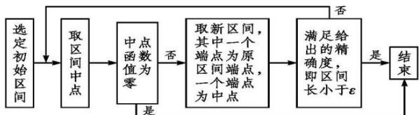

> [!faq]- 《专题4.5 函数的应用（二）（高效培优讲义）》官方解析
>
> > [!success]- **【答案】** C
>
> > [!note]- **【解析】**
> > 根据题意，依次分析选项：
> >
> > 对于 A, $f(x)=3x-1$ 在 R 上是单调函数，有唯一零点，
> >
> > 且函数值在零点两侧异号，可用二分法求零点；
> >
> > 对于 B, $f(x)=x^{3}$ 在 R 上是单调函数，有唯一零点，
> >
> > 且函数值在零点两侧异号，可用二分法求零点；
> >
> > 对于 $C, f(x) = |x|$ ，虽然也有唯一的零点，但函数值在零点两侧都是正号，
> >
> > 故不能用二分法求零点；
> >
> > 对于 $D$ ， $f(x) = \ln x$ 在 $(0, + \infty)$ 上是单调函数，有唯一零点，
> >
> > 且函数值在零点两侧异号，可用二分法求零点；
> >
> > 故选：C.
> >
> > ## 方法技巧
> >
> > 1. 用二分法求近似解的条件
> >
> > 判断一个函数能否用二分法求其零点的依据是：其图象在零点附近是连续不断的，且该零点为变号零点。因
> >
> > 此，用二分法求函数的零点近似值的方法仅对函数的变号零点适用，对函数的不变号零点不适用。
> >
> > 2. 用二分法求方程近似解的过程
> >
> > （1）依据图象估计零点所在的初始区间 $[m,n]$ （这个区间既要包含所求的根，又要使其长度尽可能的小，区间的端点尽量为整数）.
> >
> > (2) 取区间端点的平均数 $c$ ，计算 $f(c)$ ，确定有解区间是 $(m, c)$ 还是 $(c, n)$ ，逐步缩小区间的“长度”，直到
> >
> > 区间的长度符合精确度要求（这个过程中应及时检验所得区间端点差的绝对值是否达到给定的精确度），才
> >
> > 终止计算，得到函数零点的近似值（为了比较清晰地表达计算过程与函数零点所在的区间往往采用列表
> >
> > 法）.
> >
> > 3. 利用二分法求函数近似零点的流程图：
> >
> > 
